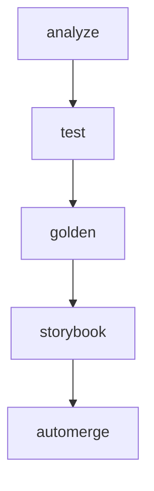

# CI Pipeline Setup Guide

## Overview

This document describes the comprehensive CI pipeline implemented to catch remaining test issues and establish proper quality gates for the Waste Segregation App.

## Pipeline Architecture

The CI pipeline consists of 5 sequential jobs that must all pass before code can be merged:



## Job Descriptions

### 1. Static Analysis & Overflow Detection (`analyze`)

**Purpose**: Catch layout overflow issues and static analysis problems

**Key Features**:

- Runs `flutter analyze --fatal-infos` to catch all warnings as errors
- Executes custom overflow detection tool on stats cards
- Fails if any layout overflow patterns are detected

**Overflow Detection Patterns**:

- Fixed width/height without Flexible/Expanded wrappers
- Large padding values (>24px) that may cause overflow
- Row widgets without proper child wrapping
- Text widgets without overflow handling
- Containers with fixed dimensions in scrollable contexts

### 2. Unit & Widget Tests (`test`)

**Purpose**: Run comprehensive test suite with Firebase emulator support

**Key Features**:

- Uses Firebase emulator for proper initialization during tests
- Generates `test/firebase_config.dart` with emulator configuration
- Runs tests with randomized ordering to catch flaky tests
- Includes coverage reporting

**Firebase Configuration**:

```dart
// Generated during CI
const bool useFirebaseEmulator = true;

// Test setup can use:
if (useFirebaseEmulator) {
  await Firebase.initializeApp();
  FirebaseFirestore.instance.useFirestoreEmulator('localhost', 8080);
}
```

### 3. Golden Tests (`golden`)

**Purpose**: Ensure visual consistency and catch UI regressions

**Key Features**:

- Automatically adds `golden_toolkit` dependency if missing
- Runs all tests tagged with `@Tags(['golden'])`
- Compares rendered widgets against baseline images
- Fails if visual differences exceed threshold

**Usage in Tests**:

```dart
@Tags(['golden'])
testGoldens('StatsCard golden test', (tester) async {
  await tester.pumpWidgetBuilder(
    StatsCard(title: 'Test', value: '42'),
    wrapper: materialAppWrapper(),
  );
  await screenMatchesGolden(tester, 'stats_card_default');
});
```

### 4. Storybook Visual Diffs (`storybook`)

**Purpose**: Cross-browser visual regression testing

**Key Features**:

- Builds Storybook with component stories
- Runs visual diff tests across multiple viewports
- Detects layout overflow in browser environment
- Captures screenshots for comparison

**Story Configuration**:

```javascript
export default {
  title: 'Components/StatsCard',
  parameters: {
    chromatic: {
      viewports: [320, 768, 1024],
      pauseAnimationAtEnd: true,
    },
  },
};
```

### 5. Auto-merge (`automerge`)

**Purpose**: Automatically merge PRs when all quality gates pass

**Key Features**:

- Only runs on pull requests to main branch
- Requires all previous jobs to succeed
- Uses squash merge to maintain clean history
- Respects branch protection rules

## Addressing Remaining Issues

### Layout Overflow (48px)

**Problem**: Stats cards have layout overflow causing visual issues

**Solution**:

- Custom overflow detection tool scans widget files
- Storybook test runner checks for runtime overflow
- Both static and dynamic detection ensure comprehensive coverage

### Firebase Initialization in Tests

**Problem**: Tests fail due to Firebase initialization issues

**Solution**:

- Firebase emulator service in CI provides real Firebase instance
- `test/firebase_config.dart` configures emulator connection
- Tests can use real Firebase APIs without external dependencies

### Missing golden_toolkit Dependency

**Problem**: Golden tests fail due to missing dependency

**Solution**:

- CI automatically detects missing `golden_toolkit`
- Adds dependency if not present in `pubspec.yaml`
- Ensures golden tests can run without manual intervention

### Complex Mock Argument Matching

**Problem**: Mock services have complex argument matching that fails

**Solution**:

- Randomized test ordering catches flaky mocks
- Firebase emulator reduces need for complex mocking
- Branch protection ensures all tests pass before merge

## Branch Protection Configuration

To enable this pipeline, configure the following branch protection rules on the `main` branch:

1. **Required Status Checks**:
   - `analyze`
   - `test`
   - `golden`
   - `storybook`

2. **Additional Settings**:
   - ✅ Require branches to be up to date before merging
   - ✅ Require status checks to pass before merging
   - ✅ Restrict pushes that create files larger than 100MB
   - ✅ Require linear history

3. **Auto-merge Settings**:
   - Enable auto-merge for the repository
   - Set default merge method to "Squash and merge"

## Local Development Workflow

### Running Individual Jobs Locally

```bash
# Static analysis
flutter analyze --fatal-infos
dart tool/check_overflows.dart lib/widgets/modern_ui/modern_cards.dart

# Tests with coverage
flutter test --coverage

# Golden tests only
flutter test --tags=golden

# Storybook development
npm run storybook

# Storybook visual tests
npm run test:storybook
```

### Pre-commit Hooks

Consider adding pre-commit hooks to catch issues early:

```bash
#!/bin/sh
# .git/hooks/pre-commit

# Run static analysis
flutter analyze --fatal-infos || exit 1

# Run overflow detection
dart tool/check_overflows.dart lib/widgets/modern_ui/modern_cards.dart || exit 1

# Run quick tests
flutter test --no-coverage || exit 1

echo "✅ Pre-commit checks passed"
```

## Monitoring and Maintenance

### CI Performance Metrics

- **Target Times**:
  - `analyze`: < 2 minutes
  - `test`: < 5 minutes
  - `golden`: < 3 minutes
  - `storybook`: < 4 minutes
  - Total pipeline: < 15 minutes

### Maintenance Tasks

1. **Weekly**: Review failed builds and update golden baselines
2. **Monthly**: Update dependencies and review overflow detection rules
3. **Quarterly**: Audit branch protection rules and CI configuration

### Troubleshooting Common Issues

**Golden Test Failures**:

```bash
# Update golden files locally
flutter test --update-goldens --tags=golden
git add test/goldens/
git commit -m "Update golden baselines"
```

**Storybook Visual Diffs**:

```bash
# Review visual differences
npm run storybook
# Navigate to failing stories and inspect changes
```

**Overflow Detection False Positives**:

```bash
# Update overflow detection rules in tool/check_overflows.dart
# Add exceptions for legitimate patterns
```

## Security Considerations

- Firebase emulator runs in isolated container
- No production credentials used in CI
- Auto-merge requires all security checks to pass
- Branch protection prevents direct pushes to main

## Future Enhancements

1. **Performance Testing**: Add Lighthouse CI for performance regression detection
2. **Accessibility Testing**: Integrate axe-core for accessibility compliance
3. **Cross-platform Testing**: Add iOS simulator and Android emulator testing
4. **Dependency Scanning**: Add automated security vulnerability scanning

---

*Last updated: June 15, 2025*
*Pipeline version: 1.0.0*
