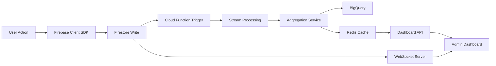

# Comprehensive Admin Analytics Dashboard Specification
**Version 1.0** | **Date: May 2025**

## Executive Summary
This document outlines a comprehensive admin analytics dashboard for the Waste Segregation App, providing the solo developer/product owner with complete visibility into user behavior, system performance, and the ability to manage users and content. The dashboard will be a web-based application providing real-time analytics, user management, and system administration capabilities.

## Table of Contents
1. [System Overview](#system-overview)
2. [Dashboard Architecture](#dashboard-architecture)
3. [Core Modules](#core-modules)
4. [User Analytics Module](#user-analytics-module)
5. [User Management Module](#user-management-module)
6. [Content Management Module](#content-management-module)
7. [System Analytics Module](#system-analytics-module)
8. [Gamification Analytics Module](#gamification-analytics-module)
9. [Revenue & Monetization Module](#revenue--monetization-module)
10. [Technical Implementation](#technical-implementation)
11. [Security & Compliance](#security--compliance)
12. [Performance Optimization](#performance-optimization)
13. [Future Enhancements](#future-enhancements)

---

## System Overview

### Purpose
The Admin Analytics Dashboard serves as a centralized command center for monitoring, analyzing, and managing all aspects of the Waste Segregation App ecosystem.

### Key Objectives
- **Real-time Monitoring**: Track user activity and system health in real-time
- **Deep Analytics**: Understand user behavior patterns and app usage trends
- **User Management**: Complete CRUD operations for user accounts
- **Content Control**: Manage educational content and waste categories
- **Performance Tracking**: Monitor API usage, cache hit rates, and system performance
- **Revenue Analytics**: Track monetization metrics and premium subscriptions

### Target User
- Solo Developer/Product Owner requiring comprehensive system oversight
- Future team members (scalable design)

---

## Dashboard Architecture

### Frontend Architecture
```
Admin Dashboard (React/Next.js)
├── Authentication Layer (Firebase Admin Auth)
├── Dashboard Shell
│   ├── Navigation Sidebar
│   ├── Header with Quick Actions
│   └── Main Content Area
├── Analytics Modules
│   ├── User Analytics
│   ├── System Analytics
│   ├── Gamification Analytics
│   └── Revenue Analytics
├── Management Modules
│   ├── User Management
│   ├── Content Management
│   └── System Settings
└── Utility Components
    ├── Data Visualization (Charts.js/D3.js)
    ├── Real-time Updates (WebSocket)
    └── Export Tools
```

### Backend Architecture
```
Backend Services (Firebase Functions + Custom API)
├── Authentication Service
│   └── Admin SDK Integration
├── Analytics Aggregation Service
│   ├── Real-time Processing
│   ├── Batch Processing
│   └── Data Warehousing
├── User Management Service
├── Content Management Service
├── Notification Service
└── Export/Report Service
```

---

## Core Modules

### 1. Dashboard Overview
**Purpose**: Provide at-a-glance insights into system health and key metrics

**Key Widgets**:
- **Active Users Now**: Real-time counter with sparkline
- **Daily Active Users (DAU)**: 30-day trend chart
- **Classifications Today**: Live counter with category breakdown
- **System Health**: API status, error rates, response times
- **Revenue Today**: Premium subscriptions and ad revenue
- **Top Alerts**: Critical issues requiring attention

**Interactive Features**:
- Click any widget to drill down into detailed analytics
- Customizable widget layout (drag & drop)
- Time range selector (Today, 7 days, 30 days, Custom)
- Auto-refresh toggle with configurable intervals

---

## User Analytics Module

### User Overview Dashboard
**Comprehensive Metrics**:

#### User Acquisition
- **New Users**: Daily/Weekly/Monthly breakdown
- **User Sources**: Organic, Social, Referral, Direct
- **Geographic Distribution**: Interactive world map
- **Device Types**: Mobile (iOS/Android), Web, Tablet
- **Acquisition Funnel**: Install → Register → First Classification → Active User

#### User Engagement
- **Session Metrics**:
  - Average session duration
  - Sessions per user
  - Screen views per session
  - Bounce rate by entry screen
- **Feature Usage Heatmap**: Visual representation of feature adoption
- **User Flow Sankey Diagram**: Common navigation paths
- **Engagement Score**: Composite metric based on multiple factors

#### User Retention
- **Cohort Analysis**: Weekly/Monthly cohorts with retention curves
- **Churn Prediction**: ML-based risk scoring
- **Win-back Campaign Performance**: Re-engagement success rates
- **Lifetime Value (LTV)**: Segmented by acquisition source

### Individual User Profile View
**Detailed User Information**:

#### Basic Information
- User ID, Email, Display Name, Photo
- Registration Date & Source
- Last Active timestamp
- Total Sessions & App Version
- Device Information & OS Version

#### Activity Timeline
- Chronological feed of all user actions
- Filterable by event type
- Expandable event details with metadata
- Session replay capability (screen recordings)

#### Classification History
- Complete list with thumbnails
- Category distribution pie chart
- Accuracy trends (user corrections)
- Most/least identified items
- Time-of-day activity patterns

#### Gamification Progress
- Current Level & Points
- Achievement Gallery with unlock dates
- Challenge participation & completion
- Streak calendar visualization
- Comparative ranking

#### User Health Metrics
- Error frequency & types
- API call patterns
- Cache hit/miss rates
- Performance metrics (load times)

#### Administrative Actions
- Edit user details
- Reset password
- Adjust gamification scores
- Send push notification
- Export user data (GDPR compliance)
- Suspend/Delete account

---

## User Management Module

### User Search & Filter
**Advanced Search Capabilities**:
- Multi-field search (name, email, ID)
- Filter by:
  - Registration date range
  - Last active date
  - User role/type
  - Geographic location
  - Activity level (classifications count)
  - Gamification level
  - Premium status
  - Family membership

### Bulk Operations
**Batch Actions**:
- Select multiple users via checkbox
- Actions available:
  - Send bulk notifications
  - Export user data
  - Apply tags/labels
  - Adjust points/levels
  - Migrate to different plans
  - Bulk delete (with confirmation)

### User Communication
**Direct Messaging**:
- In-app message composer
- Push notification builder
- Email template system
- Message history & delivery status
- A/B testing for messages

### User Segments
**Dynamic Segmentation**:
- Create custom user segments
- Save segment definitions
- Use for targeted campaigns
- Segment examples:
  - "Power Users": >50 classifications/month
  - "At Risk": No activity in 14 days
  - "Premium Potential": High engagement, free tier

---

## Content Management Module

### Waste Categories Management
**CRUD Operations**:
- Add/Edit/Delete categories & subcategories
- Visual hierarchy editor
- Icon/color management
- Multilingual support
- A/B test different categorizations

### Educational Content
**Content Library**:
- Article management (WYSIWYG editor)
- Video embedding & management
- Quiz creator with analytics
- Content performance metrics
- User feedback aggregation

### AI Model Management
**Classification Configuration**:
- Model version control
- Confidence threshold adjustment
- Custom prompts per category
- Fallback rules configuration
- A/B testing different models

### Disposal Instructions
**Location-based Management**:
- Regional instruction variants
- Regulatory compliance tracking
- Update scheduling
- User location analytics

---

## System Analytics Module

### Performance Metrics
**Real-time Monitoring**:

#### API Analytics
- Request volume (requests/second)
- Response time percentiles (p50, p95, p99)
- Error rates by endpoint
- Rate limiting statistics
- Cost per API call tracking

#### Infrastructure Health
- Server CPU/Memory usage
- Database query performance
- Storage utilization
- CDN hit rates
- WebSocket connection stats

#### AI Service Monitoring
- Gemini API usage & costs
- Classification success rates
- Average processing time
- Error categorization
- Fallback activation frequency

### Cache Analytics
**Detailed Cache Metrics**:
- Hit/Miss ratios by cache type
- Cache size & eviction rates
- Popular cached items
- Geographic cache distribution
- Cost savings from caching

### Error Tracking
**Comprehensive Error Management**:
- Real-time error feed
- Error grouping & deduplication
- Stack trace analysis
- Affected user identification
- Error trend visualization
- Automated alerting rules

---

## Gamification Analytics Module

### Achievement Analytics
**Achievement Performance**:
- Unlock rates by achievement
- Time-to-unlock distribution
- Achievement difficulty analysis
- User progression funnels
- Achievement correlation with retention

### Points & Levels
**Economy Analytics**:
- Points distribution histogram
- Level progression curves
- Points earned by action type
- Inflation/deflation tracking
- Leaderboard dynamics

### Challenge Performance
**Challenge Metrics**:
- Participation rates
- Completion rates
- Challenge difficulty scoring
- User feedback analysis
- ROI per challenge type

### Social Features
**Family/Team Analytics**:
- Family size distribution
- Inter-family activity
- Viral coefficient tracking
- Social feature adoption
- Network effects measurement

---

## Revenue & Monetization Module

### Subscription Analytics
**Premium Membership Tracking**:
- MRR (Monthly Recurring Revenue)
- Churn rate & reasons
- Upgrade/Downgrade flows
- Trial conversion rates
- Pricing experiment results
- Payment failure handling

### Advertisement Performance
**Ad Revenue Optimization**:
- CPM/CPC by placement
- Fill rates & viewability
- User engagement with ads
- Ad blocker detection rates
- Revenue per user segment

### In-app Purchases
**Transaction Analytics**:
- Purchase funnel analysis
- Popular purchase items
- Seasonal trends
- Refund rates & reasons
- Cross-sell performance

### Revenue Forecasting
**Predictive Analytics**:
- ML-based revenue projection
- Cohort-based LTV modeling
- Scenario planning tools
- Budget vs. actual tracking

---

## Technical Implementation

### Technology Stack

#### Frontend
```javascript
// Next.js 14+ with TypeScript
// Key Dependencies:
- React 18
- TypeScript 5
- Tailwind CSS
- Recharts/D3.js for visualizations
- React Query for data fetching
- Zustand for state management
- React Hook Form for forms
- Date-fns for date handling
```

#### Backend
```javascript
// Firebase Functions with Node.js
// Key Services:
- Firebase Admin SDK
- Firestore for real-time data
- BigQuery for analytics warehouse
- Redis for caching
- WebSocket for live updates
- Cron jobs for batch processing
```

### Database Schema

#### Analytics Events Collection
```typescript
interface AnalyticsEvent {
  id: string;
  userId: string;
  eventType: string;
  eventName: string;
  timestamp: Timestamp;
  sessionId: string;
  parameters: Record<string, any>;
  deviceInfo: DeviceInfo;
  processed: boolean;
  aggregated: boolean;
}
```

#### User Profiles Collection (Extended)
```typescript
interface ExtendedUserProfile {
  // Existing fields
  id: string;
  email?: string;
  displayName?: string;
  photoUrl?: string;
  
  // Analytics fields
  registrationSource: string;
  firstClassificationDate?: Timestamp;
  lastActiveDate: Timestamp;
  totalSessions: number;
  totalClassifications: number;
  
  // Engagement metrics
  engagementScore: number;
  riskScore: number;
  predictedChurnDate?: Timestamp;
  
  // Administrative
  tags: string[];
  notes: AdminNote[];
  flags: UserFlags;
  customAttributes: Record<string, any>;
}
```

#### Aggregated Analytics Collection
```typescript
interface AggregatedAnalytics {
  id: string; // Format: "daily_2025_05_27"
  type: 'hourly' | 'daily' | 'weekly' | 'monthly';
  date: Timestamp;
  metrics: {
    users: {
      active: number;
      new: number;
      returning: number;
      churned: number;
    };
    classifications: {
      total: number;
      byCategory: Record<string, number>;
      accuracy: number;
    };
    revenue: {
      total: number;
      subscriptions: number;
      ads: number;
      iap: number;
    };
    performance: {
      apiCalls: number;
      errors: number;
      avgResponseTime: number;
      cacheHitRate: number;
    };
  };
}
```

### Real-time Data Pipeline



### API Endpoints

#### Analytics APIs
```typescript
// User Analytics
GET /api/analytics/users
GET /api/analytics/users/:userId
GET /api/analytics/users/:userId/timeline
GET /api/analytics/users/:userId/export

// System Analytics  
GET /api/analytics/system/performance
GET /api/analytics/system/errors
GET /api/analytics/system/cache

// Custom Reports
POST /api/analytics/reports/generate
GET /api/analytics/reports/:reportId
```

#### Management APIs
```typescript
// User Management
GET /api/users
GET /api/users/:userId
PUT /api/users/:userId
DELETE /api/users/:userId
POST /api/users/bulk-action

// Content Management
GET /api/content/categories
POST /api/content/categories
PUT /api/content/categories/:id
DELETE /api/content/categories/:id
```

---

## Security & Compliance

### Authentication & Authorization
**Multi-layer Security**:
- Firebase Admin Authentication
- Two-factor authentication (2FA)
- IP whitelisting option
- Session management
- Audit logging for all actions

### Role-based Access Control
**Admin Roles**:
- **Super Admin**: Full access
- **Analytics Admin**: Read-only analytics
- **Content Admin**: Content management only
- **Support Admin**: User management only

### Data Privacy
**GDPR Compliance**:
- User data export functionality
- Right to be forgotten implementation
- Data retention policies
- Anonymization tools
- Consent tracking

### Security Monitoring
**Threat Detection**:
- Suspicious activity alerts
- Failed login tracking
- API abuse detection
- Data access auditing
- Regular security scans

---

## Performance Optimization

### Caching Strategy
**Multi-level Caching**:
- **Redis**: Real-time metrics (TTL: 1 minute)
- **CDN**: Static dashboard assets
- **Browser**: User-specific data (TTL: 5 minutes)
- **BigQuery**: Historical analytics (materialized views)

### Query Optimization
**Database Performance**:
- Indexed fields for common queries
- Aggregation pipelines for complex analytics
- Partitioned tables for time-series data
- Query result caching
- Connection pooling

### Frontend Optimization
**Dashboard Performance**:
- Lazy loading for charts
- Virtual scrolling for large lists
- Web Workers for data processing
- Progressive Web App (PWA) features
- Optimistic UI updates

---

## Future Enhancements

### Phase 2 Features
1. **Predictive Analytics**
   - Churn prediction models
   - Revenue forecasting
   - User behavior prediction
   - Anomaly detection

2. **Advanced Automation**
   - Automated user segmentation
   - Smart notification scheduling
   - A/B test automation
   - Performance optimization suggestions

3. **Integration Capabilities**
   - Slack/Discord notifications
   - Zapier integration
   - Custom webhook support
   - Third-party analytics tools

4. **Mobile Admin App**
   - iOS/Android admin app
   - Push notifications for alerts
   - Quick actions on-the-go
   - Biometric authentication

### Phase 3 Features
1. **AI-Powered Insights**
   - Natural language queries
   - Automated insight generation
   - Trend detection & alerting
   - Prescriptive analytics

2. **Advanced Visualization**
   - 3D data visualizations
   - VR analytics dashboard
   - Interactive data stories
   - Custom dashboard builder

3. **Ecosystem Expansion**
   - Multi-app management
   - Cross-app analytics
   - Unified user profiles
   - Federation capabilities

---

## Implementation Roadmap

### Month 1: Foundation
- [ ] Set up Next.js project with TypeScript
- [ ] Implement authentication system
- [ ] Create basic dashboard layout
- [ ] Set up Firebase Admin SDK
- [ ] Implement user listing & search

### Month 2: Core Analytics
- [ ] Build real-time analytics pipeline
- [ ] Implement user analytics views
- [ ] Create data visualization components
- [ ] Add export functionality
- [ ] Set up WebSocket connections

### Month 3: Management Features
- [ ] Complete user CRUD operations
- [ ] Build content management system
- [ ] Implement bulk operations
- [ ] Add notification system
- [ ] Create admin audit logs

### Month 4: Advanced Features
- [ ] Implement predictive analytics
- [ ] Build automated alerting
- [ ] Add A/B testing tools
- [ ] Create custom report builder
- [ ] Performance optimization

### Month 5: Polish & Launch
- [ ] Security hardening
- [ ] Performance testing
- [ ] Documentation completion
- [ ] Admin training materials
- [ ] Production deployment

---

## Conclusion

This comprehensive admin analytics dashboard will provide complete visibility and control over the Waste Segregation App ecosystem. The modular architecture ensures scalability, while the real-time capabilities enable proactive management. With deep analytics, powerful user management tools, and automated insights, this dashboard will be an indispensable tool for driving app growth and user satisfaction.

The implementation focuses on actionable insights rather than vanity metrics, ensuring every feature directly contributes to better decision-making and app improvement. As the app grows, the dashboard can scale accordingly, with the architecture supporting future enhancements and integrations.

---

## Appendices

### A. Sample Dashboard Screenshots
*[Wireframes and mockups would be inserted here]*

### B. API Documentation
*[Detailed API specifications would be included here]*

### C. Database Indexes
```javascript
// Recommended Firestore Indexes
users: email, createdAt, lastActive, engagementScore
analytics_events: userId + timestamp, eventType + timestamp
classifications: userId + timestamp, category + timestamp
```

### D. Monitoring & Alerting Rules
```yaml
alerts:
  - name: high_error_rate
    condition: error_rate > 5%
    duration: 5 minutes
    severity: critical
    
  - name: low_cache_hit_rate  
    condition: cache_hit_rate < 80%
    duration: 15 minutes
    severity: warning
    
  - name: api_response_time
    condition: p95_response_time > 1000ms
    duration: 10 minutes
    severity: warning
```

### E. Cost Optimization Guidelines
- Use BigQuery scheduled queries for aggregations
- Implement intelligent caching to reduce API calls
- Archive old data to cold storage
- Use Firebase emulator for development
- Monitor and optimize Firestore reads/writes

---

*Document Version: 1.0*  
*Last Updated: May 2025*  
*Author: Admin Dashboard Specification System*