# User Flow Diagram Templates
*Last Updated: December 2024*

This document provides Mermaid diagram templates and examples for visualizing the comprehensive user flows catalog. Use these templates to create detailed flow diagrams for development and design teams.

## Template Structure

### Basic Flow Template
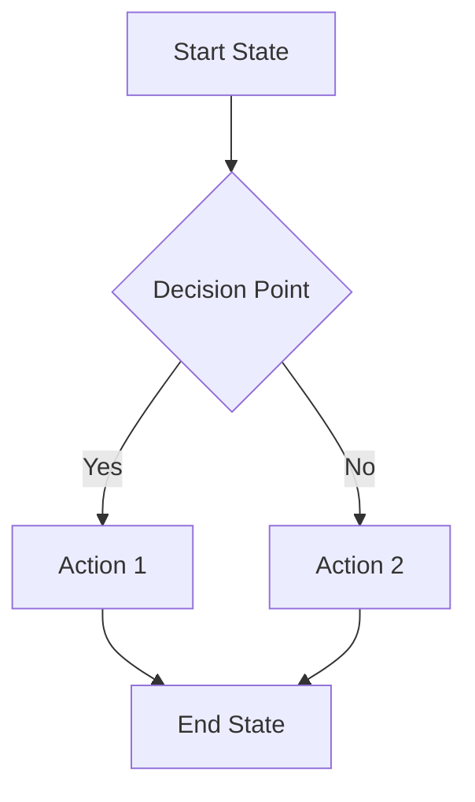

### Multi-Actor Flow Template
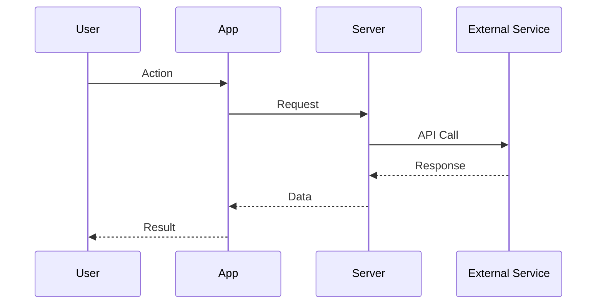

## Core Flow Examples

### 1. Batch Scan Mode Flow
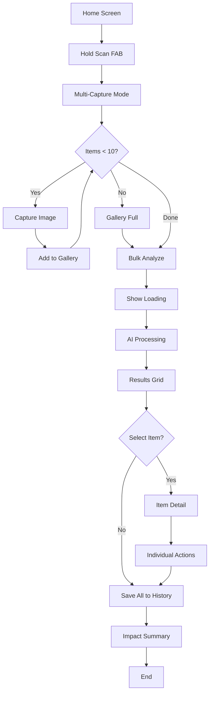

### 2. Voice Classification Flow
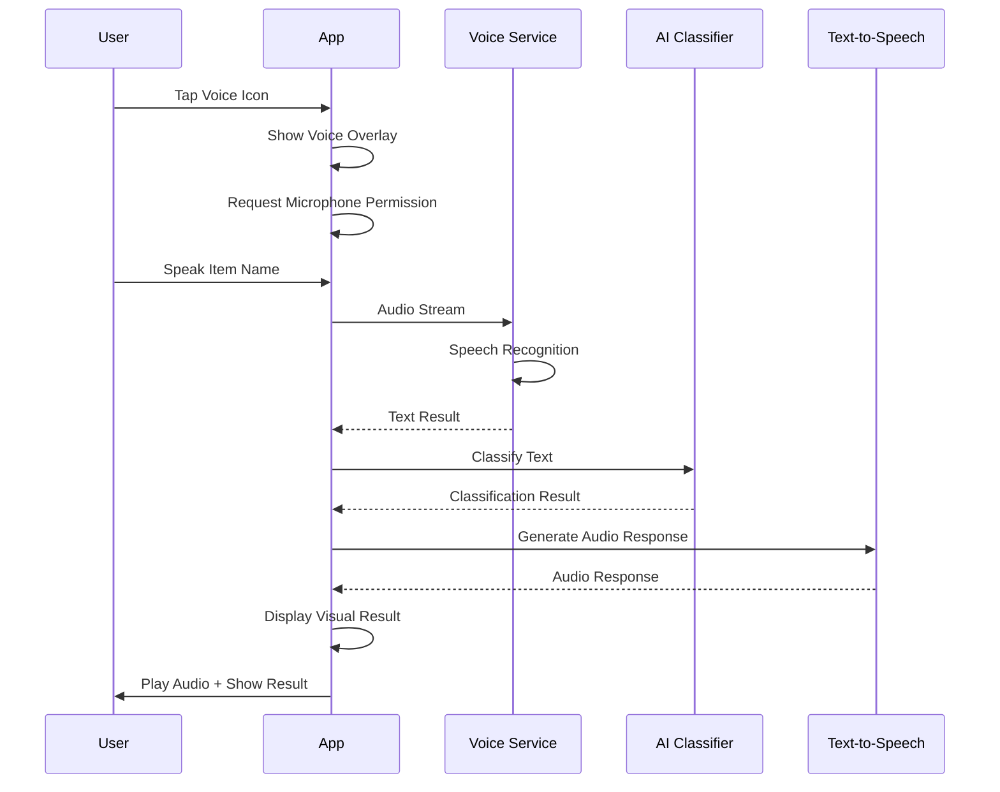

### 3. Daily Eco-Quest Flow
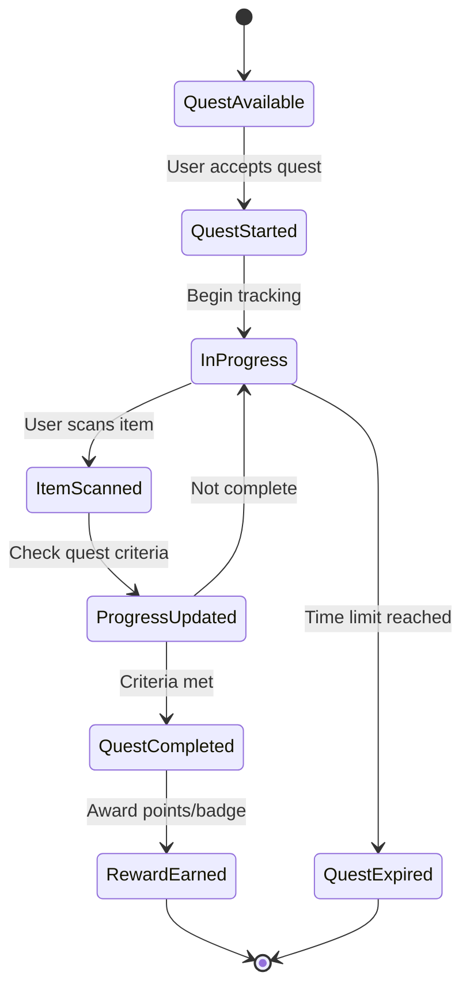

### 4. AR Sorting Guidance Flow
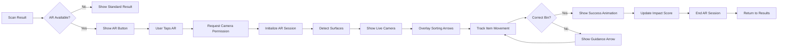

## Advanced Flow Examples

### 5. IoT Bin Monitoring Flow
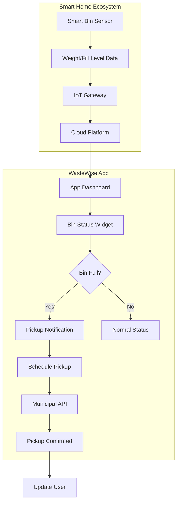

### 6. Community Cleanup Event Flow
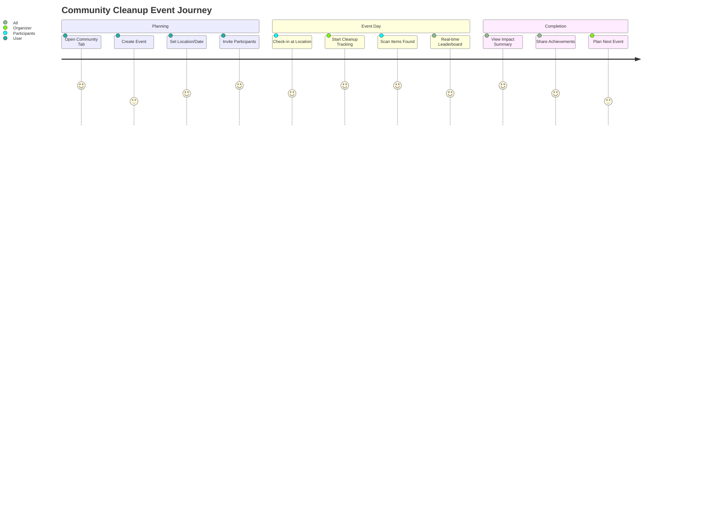

### 7. Enterprise Waste Audit Flow
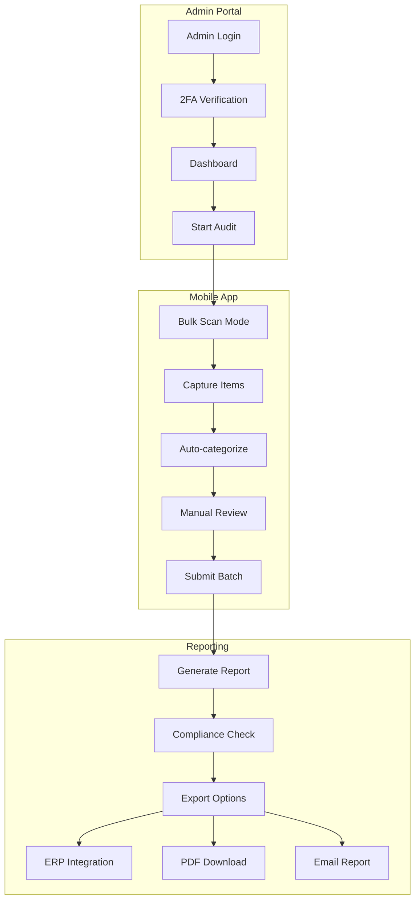

## Error Handling Patterns

### Network Error Flow
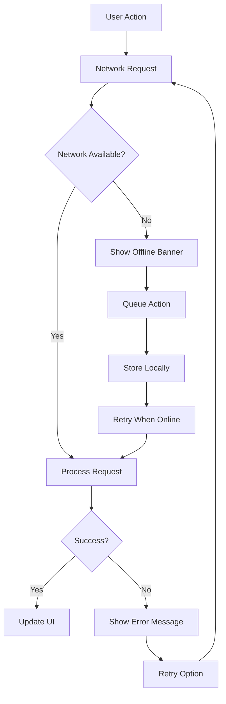

### Permission Denied Flow
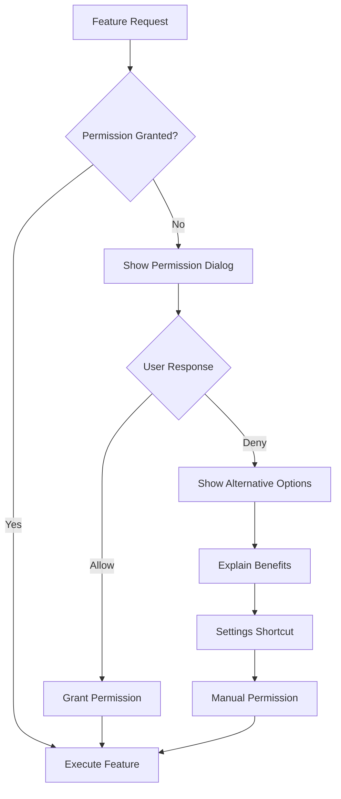

## Integration Patterns

### Third-Party Service Integration
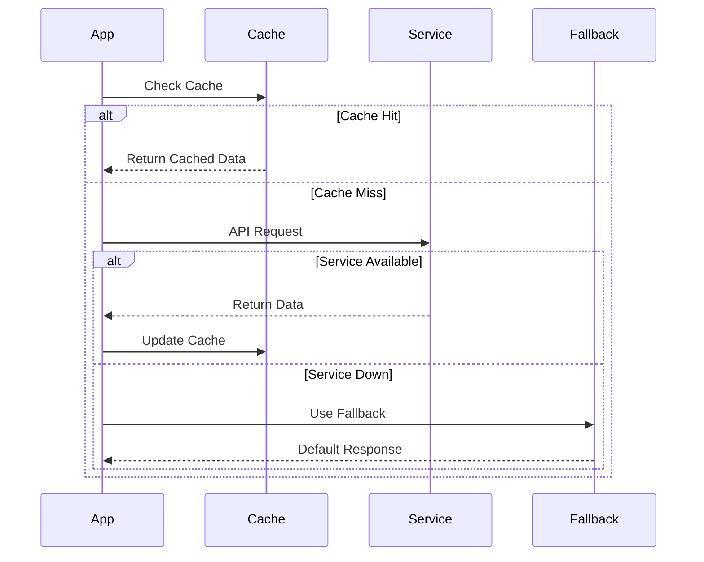

## Usage Guidelines

### When to Use Each Diagram Type

1. **Flowcharts**: Linear processes with decision points
2. **Sequence Diagrams**: Multi-actor interactions over time
3. **State Diagrams**: Complex state management
4. **Journey Maps**: User experience over time
5. **Graph Diagrams**: System architecture and relationships

### Best Practices

1. **Keep it Simple**: One flow per diagram
2. **Use Consistent Naming**: Standard terminology across flows
3. **Include Error States**: Show what happens when things go wrong
4. **Add Context**: Include relevant system boundaries
5. **Version Control**: Track changes to flow diagrams

### Diagram Maintenance

- Review diagrams monthly for accuracy
- Update when features change
- Link to implementation tickets
- Include in code review process
- Export as images for documentation

---

## Template Library

Copy and modify these templates for your specific flows:

### Basic User Action Flow
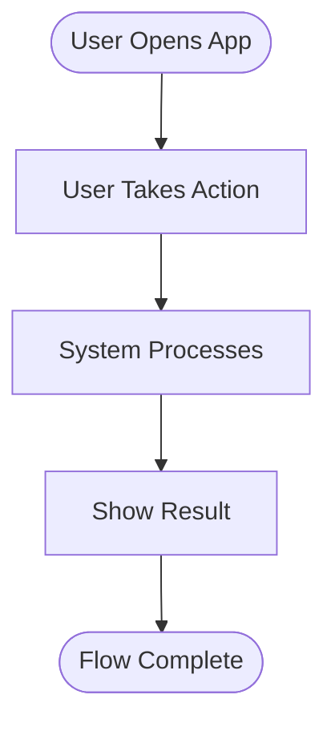

### Decision-Heavy Flow
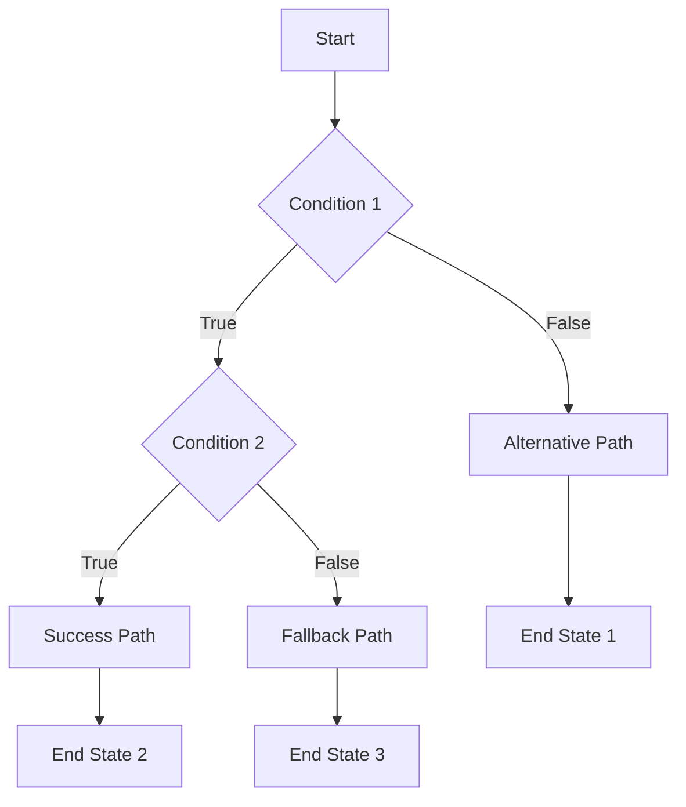

### Multi-Screen Flow
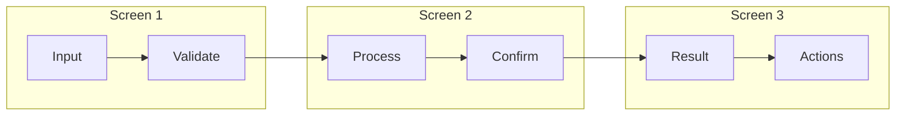

Use these templates as starting points for documenting your specific user flows. 