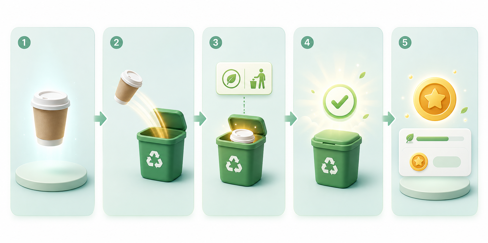

# Living Waste Journey Animation

## Purpose

This is an exploratory visual concept for the post-classification result experience.

The idea is to make the waste item feel like it has a short, understandable journey:

`capture -> classify -> move to correct bin -> apply local rule -> show impact saved -> lightly reward`

This is not a shipping requirement. It is a prototype direction for a more ambitious result-screen experience that still preserves clarity.

## Reference Visual

The generated storyboard reference lives here:

Use this as a composition and pacing reference, not as a locked asset.

## Where It Fits In The Result Screen

Best placement:

1. After the classification summary is visible.
2. Before deep explanatory content like disposal detail accordions or long educational sections.
3. Inside a reserved hero lane on the result screen, not as a full-screen takeover.

Recommended behavior:

- Keep the classification name, category, and disposal guidance readable at all times.
- Let the animation sit beside or just above the main result summary.
- Use the journey as a confirmation layer, not as the only way to understand the result.

If the result screen is already dense, the journey should collapse into a smaller success-state treatment instead of expanding the layout.

## Low-Cost V1

This is the version that feels realistic for the current Flutter stack.

### Shape of V1

- One compact widget that runs after classification success.
- Built with Flutter implicit animations only.
- Uses simple motion primitives:
  - fade
  - slide
  - scale
  - small particle burst
  - single reward chip reveal
- Shows one waste item, one correct bin, one local-rule chip, one impact-saved moment, and one small points cue.

### Suggested timing

- 0-250 ms: item appears
- 250-700 ms: item moves toward the correct bin
- 700-950 ms: local rule chip appears
- 950-1250 ms: impact saved check or leaf burst
- 1250-1600 ms: points/reward appears softly

### Why V1 is good

- Low engineering cost.
- Low integration risk.
- Easy to test.
- Easy to disable or simplify.
- Fits the app’s current Material/Flutter architecture.

### V1 implementation style

- Prefer one animation timeline over many independent controllers.
- Reuse existing result-screen primitives where possible.
- Keep the animation self-contained so the main result content stays stable.

## Ambitious V2

This version turns the journey into a memorable product moment.

### Shape of V2

- A richer “micro-story” that feels more alive and less like a generic toast.
- Could use:
  - Flutter implicit animations for base motion
  - Rive for a more organic object path
  - Lottie for small celebratory accents
  - lightweight particle effects
  - optional parallax layers for depth
- The waste item could feel almost “guided” into the right bin rather than simply moving linearly.
- The local-rule chip could become a contextual card that slides in from the relevant region or category.
- The impact-saved moment could briefly spotlight the environmental effect, then fade back to the static result.

### Why V2 is interesting

- Stronger emotional payoff.
- Better opportunity for a branded, memorable result moment.
- Better candidate for future premium polish, seasonal campaigns, or special achievement moments.

### Why V2 should stay optional

- It should not become a hard dependency for result comprehension.
- It should not make the result screen slower or more fragile.
- It should not become a separate animation system that competes with the rest of the app.

## Accessibility And Reduced Motion

Reduced motion must have a first-class alternative.

### If motion is reduced

- Skip the travel path.
- Show the waste item already at the correct bin.
- Show the local-rule chip as a static pill or card.
- Show impact saved as a still checkmark / leaf badge.
- Show points as a simple number or badge without bounce.

### Rules

- Respect `MediaQuery.disableAnimations`.
- Also treat accessible-navigation users as reduced-motion users.
- Do not rely on motion to communicate the category, disposal rule, or outcome.
- Keep semantics and text complete even if all animation is removed.

The reduced-motion version should still feel intentional, not broken.

## Performance Concerns

The animation should be cheap enough to run without affecting result readability.

### Main risks

- Too many simultaneous controllers.
- Too many particles or shadows.
- Large raster assets on low-memory devices.
- Layout shifts that push the result summary downward.
- Re-running the sequence every time the screen rebuilds.

### Guardrails

- Keep the hero area size stable.
- Prefer a single shared timeline.
- Limit particles to a small burst.
- Avoid full-screen blur effects.
- Avoid large Rive/Lottie compositions unless they earn their cost.
- Cache or reuse assets only if they are actually used repeatedly.

### Practical performance rule

If the animation ever makes the result harder to read on a mid-range phone, it is too expensive.

## What Not To Animate

Do not animate the parts that carry the core meaning.

Avoid animating:

- the main classification label
- the disposal instruction text
- the confidence / certainty explanation
- correction fields and feedback prompts
- long accordions or educational text blocks
- navigation controls like back, share, or refresh
- anything that makes the user wait for the answer itself

Also avoid:

- heavy confetti that steals focus
- continuous looping motion on the result screen
- layout jank that changes the reading order
- motion that implies certainty where the model is uncertain

## Sample Storyboard

1. **Item appears**
   - The classified waste item enters the hero area.
   - It is shown clearly enough to feel like the user’s scan result, not a random decoration.

2. **Moves to the correct bin**
   - The item glides or drops into the right bin.
   - The motion should be direct and easy to follow.

3. **Local rule chip appears**
   - A compact rule chip or card explains why this bin is correct.
   - This is the “why” moment.

4. **Impact saved**
   - A checkmark, leaf burst, or small sunburst marks the positive outcome.
   - This is the “you did the right thing” moment.

5. **Points/reward**
   - A small points badge or coin-like accent appears last.
   - This should feel like a light reward, not the main event.

## Recommended Product Constraint

The animation should support comprehension, not compete with it.

That means:

- the result answer wins first
- the journey comes second
- the reward comes last
- reduced motion still tells the same story

## Open Direction

If this concept moves forward, the most likely implementation path is:

1. Start with a Flutter-only V1.
2. Validate that it does not interfere with the current result screen.
3. Upgrade select moments to Rive or Lottie only if the extra polish clearly pays for itself.
4. Keep a reduced-motion snapshot version available from day one.

