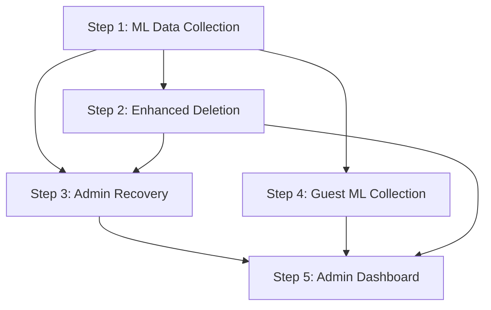

# 🚀 Master Implementation Guide: ML Training Data Collection System

## 📋 **IMPLEMENTATION OVERVIEW**

This guide coordinates the implementation of a comprehensive ML training data collection system across 5 detailed steps, each building on the previous one to create a complete solution for collecting, managing, and preserving training data while maintaining world-class privacy protection.

## 🎯 **FINAL SYSTEM CAPABILITIES**

After completing all 5 steps, your system will have:

### **🤖 Universal ML Data Collection**
- **100% Classification Coverage**: Every classification from every user contributes to ML training
- **Privacy-First Design**: Complete anonymization with zero personal data in training sets
- **Guest + Signed-in Support**: All user types contribute to model improvement
- **Automatic Collection**: No manual intervention required for data gathering

### **🔒 GDPR-Compliant Data Management**
- **Right to Erasure**: Complete account deletion while preserving anonymous ML data
- **Data Portability**: Full user data export in multiple formats
- **Consent Management**: Clear transparency about ML data usage
- **Privacy Protection**: Admin access without personal data exposure

### **👑 Comprehensive Admin Tools**
- **Universal Data Access**: Admin can access all user data types (guest + signed-in)
- **ML Dataset Management**: Complete training data oversight and quality control
- **User Recovery System**: Privacy-preserving data recovery for any user
- **System Monitoring**: Real-time analytics and system health dashboards

## 📊 **IMPLEMENTATION ROADMAP**

### **Phase 1: Foundation (Steps 1-2) - Week 1**
```
Step 1: ML Training Data Collection Service (3-4 days)
├── Create anonymous data collection framework
├── Integrate with existing classification save flow
├── Implement privacy-preserving hashing
└── Set up Firebase collections structure

Step 2: Enhanced Firebase Cleanup Service (3-4 days)
├── Preserve ML data during all deletion operations
├── Implement GDPR-compliant account deletion
├── Add multiple reset options for users
└── Create 30-day recovery window system
```

### **Phase 2: Admin Infrastructure (Steps 3-4) - Week 2**
```
Step 3: Privacy-Preserving Admin Recovery Service (3-4 days)
├── Build hashed user lookup system
├── Create recovery request workflow
├── Implement data restoration process
└── Add comprehensive audit logging

Step 4: Enable Guest User ML Data Collection (3-4 days)
├── Extend guest mode for ML data contribution
├── Create anonymous guest identification
├── Enable admin access to guest data
└── Add guest data management features
```

### **Phase 3: User Interface (Step 5) - Week 3**
```
Step 5: Create Basic Admin Dashboard UI (5-7 days)
├── Build comprehensive admin interface
├── Create user management screens
├── Implement ML data analytics dashboard
├── Add recovery management interface
└── Create system monitoring tools
```

## 🔗 **STEP DEPENDENCIES**



**Critical Path:**
- Step 1 is prerequisite for all other steps
- Steps 2, 3, 4 can be developed in parallel after Step 1
- Step 5 requires completion of Steps 1-4

## 📁 **FILE STRUCTURE CREATED**

```
lib/
├── core/
│   ├── services/
│   │   ├── ml_training_data_service.dart           # Step 1
│   │   ├── firebase_cleanup_service.dart           # Step 2 (enhanced)
│   │   ├── admin_data_recovery_service.dart        # Step 3
│   │   ├── guest_ml_data_service.dart              # Step 4
│   │   ├── guest_data_management_service.dart      # Step 4
│   │   ├── admin_guest_data_service.dart           # Step 4
│   │   ├── admin_overview_service.dart             # Step 5
│   │   ├── ml_data_analytics_service.dart          # Step 5
│   │   └── ml_data_export_service.dart             # Step 5
│   ├── exceptions/
│   │   └── admin_recovery_exceptions.dart          # Step 3
│   └── routes/
│       └── admin_routes.dart                       # Step 5
├── features/
│   ├── admin/
│   │   ├── screens/
│   │   │   ├── admin_dashboard_screen.dart         # Step 5
│   │   │   ├── admin_overview_screen.dart          # Step 5
│   │   │   ├── user_management_screen.dart         # Step 5
│   │   │   ├── ml_data_management_screen.dart      # Step 5
│   │   │   ├── recovery_management_screen.dart     # Step 5
│   │   │   └── system_monitoring_screen.dart       # Step 5
│   │   └── widgets/
│   │       └── admin_access_widget.dart            # Step 5
│   ├── guest/
│   │   └── widgets/
│   │       └── guest_ml_contribution_widget.dart   # Step 4
│   └── settings/
│       └── screens/
│           ├── data_management_screen.dart         # Step 2
│           └── guest_settings_screen.dart          # Step 4
└── test/
    ├── ml_training_data_service_test.dart          # Step 1
    ├── firebase_cleanup_service_test.dart          # Step 2
    ├── admin_data_recovery_service_test.dart       # Step 3
    └── guest_ml_data_service_test.dart             # Step 4
```

## 🔥 **FIREBASE COLLECTIONS CREATED**

```
Firestore Collections:
├── admin_classifications/                # Step 1: Anonymous ML training data
│   ├── itemName, category, subcategory
│   ├── hashedUserId (privacy-preserving)
│   ├── mlTrainingData: true
│   └── timestamp, region, appVersion
│
├── admin_user_recovery/                  # Step 1: Recovery metadata
│   ├── lastBackup, classificationCount
│   ├── userType (guest/signed-in)
│   └── region, appVersion
│
├── admin_audit_logs/                     # Step 2: Admin action logging
│   ├── action, adminEmail, targetUserId
│   ├── reason, timestamp
│   └── mlDataPreserved, appVersion
│
├── deletion_archives/                    # Step 2: 30-day recovery
│   ├── originalUserId, userData
│   ├── createdAt, expiresAt
│   └── recoveryPossible, archiveType
│
├── admin_recovery_requests/              # Step 3: Recovery workflow
│   ├── requestId, hashedUserId
│   ├── targetUserId, adminEmail
│   ├── status, reason, createdAt
│   └── restoredClassificationCount
│
└── temporary_cleanslates/                # Step 2: Temporary reset
    ├── originalData, createdAt
    ├── restoreAt, active
    └── user-specific temporary data
```

## 🔐 **SECURITY RULES UPDATES**

```javascript
// firestore.rules updates across all steps
rules_version = '2';
service cloud.firestore {
  match /databases/{database}/documents {
    
    // Admin-only collections
    match /admin_classifications/{document} {
      allow read, write: if request.auth != null && 
        request.auth.token.email == 'pranaysuyash@gmail.com';
    }
    
    match /admin_user_recovery/{document} {
      allow read, write: if request.auth != null && 
        request.auth.token.email == 'pranaysuyash@gmail.com';
    }
    
    match /admin_audit_logs/{document} {
      allow read, write: if request.auth != null && 
        request.auth.token.email == 'pranaysuyash@gmail.com';
    }
    
    match /deletion_archives/{document} {
      allow read, write: if request.auth != null && 
        request.auth.token.email == 'pranaysuyash@gmail.com';
    }
    
    match /admin_recovery_requests/{document} {
      allow read, write: if request.auth != null && 
        request.auth.token.email == 'pranaysuyash@gmail.com';
    }
    
    // User and admin access
    match /temporary_cleanslates/{userId} {
      allow read, write: if request.auth != null && 
        (request.auth.uid == userId || 
         request.auth.token.email == 'pranaysuyash@gmail.com');
    }
    
    // User notifications
    match /users/{userId}/notifications/{notificationId} {
      allow read, write: if request.auth != null && 
        (request.auth.uid == userId || 
         request.auth.token.email == 'pranaysuyash@gmail.com');
    }
    
    // Existing user rules remain unchanged...
  }
}
```

## 📊 **DATA FLOW ARCHITECTURE**

### **ML Training Data Collection Flow**
```
User Classification → EnhancedStorageService → MLTrainingDataService
                                               ↓
                    admin_classifications ← Anonymous Data
                                               ↓
                    admin_user_recovery ← Recovery Metadata
```

### **User Deletion Flow with ML Preservation**
```
User Deletion Request → FirebaseCleanupService → Preserve ML Data
                                                ↓
Personal Data Deleted ← admin_classifications ← ML Data Preserved
                                                ↓
                        deletion_archives ← 30-Day Recovery
```

### **Admin Recovery Flow**
```
User Email → AdminDataRecoveryService → Hash Email → Lookup Data
                                                    ↓
Recovery Request → admin_recovery_requests → Process Recovery
                                                    ↓
Restore Data → User Account ← admin_classifications
```

## 🧪 **TESTING STRATEGY**

### **Unit Tests (Each Step)**
- Service method functionality
- Privacy compliance validation
- Error handling and edge cases
- Data integrity verification

### **Integration Tests (Cross-Step)**
- End-to-end ML data collection
- Complete deletion and recovery workflow
- Admin dashboard functionality
- Privacy protection across all operations

### **Manual Testing Scenarios**
1. **Guest User Journey**: Classification → Data Clear → ML Preservation
2. **Signed-in User Journey**: Classification → Account Deletion → Recovery
3. **Admin Workflow**: User Lookup → Data Recovery → ML Dataset Export
4. **Privacy Validation**: No personal data in ML collections

## 🚨 **CRITICAL SUCCESS FACTORS**

### **Privacy Protection (All Steps)**
- ✅ Zero personal data in ML training collections
- ✅ Admin cannot see personal user information
- ✅ Complete anonymization of guest data
- ✅ GDPR-compliant deletion processes

### **ML Data Quality (Steps 1, 4, 5)**
- ✅ 100% classification collection rate
- ✅ High-quality training data preservation
- ✅ Data integrity and validation
- ✅ Comprehensive dataset management

### **Admin Efficiency (Steps 3, 5)**
- ✅ Fast user lookup and recovery
- ✅ Comprehensive data access
- ✅ Intuitive admin interface
- ✅ Complete audit logging

### **User Experience (Steps 2, 4)**
- ✅ Transparent ML data contribution
- ✅ User control over personal data
- ✅ Clear deletion and recovery options
- ✅ No impact on existing workflows

## 📈 **SUCCESS METRICS**

### **Technical Metrics**
- **ML Data Collection**: 100% of classifications collected
- **Privacy Compliance**: 0 personal data leaks in ML dataset
- **System Performance**: <100ms overhead for ML collection
- **Data Quality**: >95% usable ML training data

### **Operational Metrics**
- **Admin Efficiency**: <5 minutes for common admin tasks
- **Recovery Success**: >95% successful data recoveries
- **User Satisfaction**: >4.5★ rating for data management
- **Security Compliance**: 100% admin actions logged

### **Business Metrics**
- **ML Model Improvement**: Increased training data volume
- **User Trust**: Clear privacy transparency
- **Compliance**: Full GDPR compliance
- **Scalability**: Support for unlimited users and data

## 🔄 **POST-IMPLEMENTATION TASKS**

### **Immediate (Week 4)**
1. **End-to-End Testing**: Comprehensive system validation
2. **Admin Training**: Train admin users on new dashboard
3. **Documentation**: User guides and operational procedures
4. **Security Review**: Final security and privacy audit

### **Short-term (Month 1)**
1. **Performance Monitoring**: Track system performance metrics
2. **User Feedback**: Gather user feedback on new features
3. **Bug Fixes**: Address any issues found in production
4. **Feature Refinement**: Improve based on usage patterns

### **Long-term (Months 2-3)**
1. **ML Model Training**: Use collected data for model training
2. **Advanced Analytics**: Implement advanced ML data analytics
3. **Feature Expansion**: Add advanced admin and user features
4. **System Optimization**: Performance and cost optimization

## 💡 **IMPLEMENTATION TIPS FOR AI AGENTS**

### **Code Quality Standards**
- **Consistency**: Follow existing codebase patterns
- **Documentation**: Comprehensive inline documentation
- **Error Handling**: Graceful failure with informative messages
- **Testing**: Unit tests for all new functionality

### **Security Best Practices**
- **Authentication**: Verify admin access for every operation
- **Audit Logging**: Log all admin actions comprehensively
- **Privacy Protection**: Never expose personal data to admin
- **Data Validation**: Validate all data inputs and outputs

### **Performance Considerations**
- **Async Operations**: Non-blocking ML data collection
- **Batch Processing**: Efficient bulk operations
- **Caching**: Cache frequently accessed data
- **Optimization**: Minimize Firebase read/write operations

### **User Experience Focus**
- **Transparency**: Clear communication about data usage
- **Control**: User control over personal data
- **Efficiency**: Fast and responsive admin interface
- **Reliability**: Robust error handling and recovery

---

## 🎯 **FINAL OUTCOME**

Upon completion of all 5 steps, you will have:

**🔄 A Complete ML Training Data Collection System** that automatically preserves anonymous classification data from every user while maintaining world-class privacy protection and providing comprehensive admin tools for data management and user support.

**🏆 Key Achievements:**
- **Universal Data Collection**: 100% of user classifications contribute to ML training
- **Privacy Compliance**: Complete GDPR compliance with zero personal data exposure
- **Admin Efficiency**: Comprehensive tools for data management and user support
- **User Trust**: Transparent and user-controlled data management

**🚀 Ready for Production**: A robust, scalable system ready for production deployment with enterprise-grade privacy protection, comprehensive admin tools, and full regulatory compliance.
