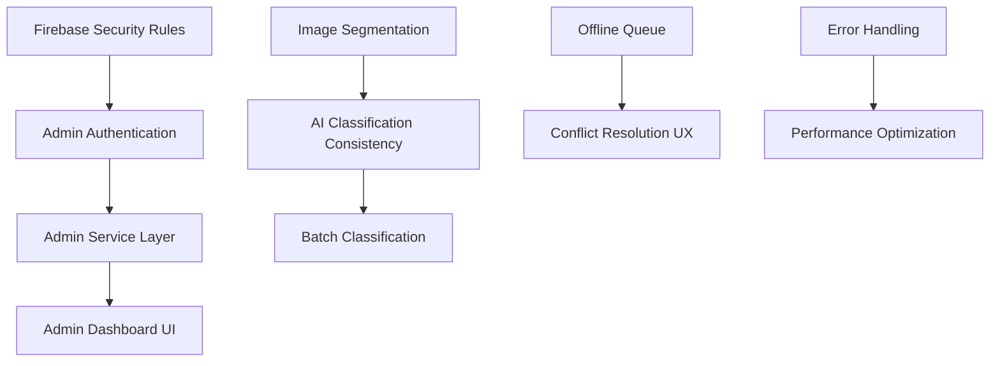

# 📋 Comprehensive Task Matrix

**Document Date**: December 14, 2024  
**Version**: 1.0  
**Status**: Master Planning Document  
**Source**: Consolidated from all docs and code TODOs

---

## 🎯 Overview

This document serves as the **master planning sheet** for all development tasks across the waste segregation app. Tasks are organized by category and priority, drawn from comprehensive analysis of documentation and code TODOs.

**Usage Guidelines:**
- **Sprint Planning**: Pull all High priority items first
- **Next Releases**: Schedule Medium priority items as capacity allows  
- **Backlog Grooming**: Revisit Low & Ongoing tasks quarterly

---

## 📊 Priority Distribution

| Priority | Count | Percentage |
|----------|-------|------------|
| **High** | 15 | 48% |
| **Medium** | 11 | 35% |
| **Low** | 4 | 13% |
| **Ongoing** | 1 | 3% |

---

## 🔥 HIGH Priority Tasks (Sprint 1-2)

### **AI & Core Features**
| Task | Notes/Location | Estimated Effort |
|------|----------------|------------------|
| **LLM-Generated Disposal Instructions** | Replace hard-coded steps with LLM (see docs/planning/MASTER_TODO_COMPREHENSIVE.md) | 2-3 weeks |
| **Image Segmentation Enhancement (SAM, multi-object)** | Complete SAM integration & user controls | 2-3 weeks |
| **AI Classification Consistency & Re-Analysis** | Add "Re-Scan" button and feedback aggregation | 1-2 weeks |
| **Confidence Threshold Slider** | Settings UI control for auto vs. manual classification | 1 week |
| **Batch Classification** | Gallery multi-select + queued scans | 2 weeks |

### **UI/UX & Platform**
| Task | Notes/Location | Estimated Effort |
|------|----------------|------------------|
| **Dark Mode & Glassmorphism Theming** | Dynamic theming across all screens | 1-2 weeks |
| **Platform-Native Animations (iOS vs Android)** | Apply Material You on Android, SF-style on iOS | 2-3 weeks |
| **Camera Permission Retry Flow** | Friendly walkthrough to re-enable camera permissions | 1 week |
| **Segmentation-Fail Fallback** | Manual crop tool when no objects detected | 1-2 weeks |
| **Rate-Limit Feedback** | "Please wait" indicator on API throttling | 3-5 days |

### **Technical Debt & Security**
| Task | Notes/Location | Estimated Effort |
|------|----------------|------------------|
| **Firebase Security Rules** | Comprehensive Firestore rules + CI tests | 1-2 weeks |
| **Performance & Memory Optimization** | Image caching, analytics batching, leak prevention | 2-3 weeks |
| **Error Handling & Retry Mechanisms** | Global error UI + exponential backoff | 1-2 weeks |

### **CI/CD & Quality Gates**
| Task | Notes/Location | Estimated Effort |
|------|----------------|------------------|
| **Docs-Lint Workflow** | Fail CI if markdown TODOs remain | 3-5 days |
| **Code Quality Checks** | dart analyze, flutter test --coverage, dart_code_metrics on every PR | 1 week |

### **Offline & Sync Behavior**
| Task | Notes/Location | Estimated Effort |
|------|----------------|------------------|
| **Offline Queue & Auto-Sync** | Cache scans offline, sync on reconnection | 2-3 weeks |
| **Conflict-Resolution UX** | In-app merge dialogs on sync conflicts | 1-2 weeks |
| **Connectivity Indicator** | Banner/icon when offline | 3-5 days |

### **Family & Social Features**
| Task | Notes/Location | Estimated Effort |
|------|----------------|------------------|
| **Family Invite via SMS/Email/Share Sheet** | Expand share options in family_invite_screen.dart | 1-2 weeks |
| **Challenge-Driven Achievements** | Generate & navigate to completed challenges | 2-3 weeks |

---

## ⚡ MEDIUM Priority Tasks (Sprint 3-4)

### **Accessibility & I18n**
| Task | Notes/Location | Estimated Effort |
|------|----------------|------------------|
| **a11y Audit & Scanner** | Run accessibility_test on key screens | 1-2 weeks |
| **Localization Completion & CI Reports** | Validate ARB files, report missing translations | 1 week |
| **Voice-Guided Scan & Large-Text Mode** | Haptic/audio cues + respect system text scale | 2-3 weeks |

### **Testing & Quality**
| Task | Notes/Location | Estimated Effort |
|------|----------------|------------------|
| **End-to-End Tests for Reset/Delete & Restore** | Flutter integration tests on account flows | 1-2 weeks |
| **Inactive-Cleanup Cron Simulator** | Harness to fast-forward time and run cleanup | 1 week |
| **Firestore Rules Testing** | Automate via Firebase Emulator Suite | 1 week |

### **Analytics & Telemetry**
| Task | Notes/Location | Estimated Effort |
|------|----------------|------------------|
| **Event Instrumentation & Funnel Analysis** | Track scans, re-analysis, shares for product insights | 1-2 weeks |
| **Usage Survey Widget** | Prompt users for feedback after N scans | 1 week |

### **Personalization & Settings**
| Task | Notes/Location | Estimated Effort |
|------|----------------|------------------|
| **Scan Presets** | Save common contexts (e.g. "Kitchen") | 1-2 weeks |
| **Custom Waste Categories** | Allow user-defined categories | 2-3 weeks |

### **Social & Sharing**
| Task | Notes/Location | Estimated Effort |
|------|----------------|------------------|
| **One-Tap Social Cards** | Pre-formatted shareable images ("I just recycled…") | 1-2 weeks |
| **Group Challenges** | Invite friends to mini-challenges | 2-3 weeks |

---

## 🔧 LOW Priority Tasks (Future Sprints)

### **Monitoring & Observability**
| Task | Notes/Location | Estimated Effort |
|------|----------------|------------------|
| **Crashlytics "Test Crash" Verification** | Ensure crash events are captured | 2-3 days |
| **Performance Benchmark Suite** | Measure segmentation latency on target devices | 1 week |

### **Dev-Phase Debug Tools**
| Task | Notes/Location | Estimated Effort |
|------|----------------|------------------|
| **Hidden /debug Panel & Feature-Flag Dashboard** | Behind ENABLE_DEBUG_UI flag | 1 week |
| **Firestore Backup Validation & Rollback Drill Scripts** | Periodic backup checks + rollback procedure | 1 week |

---

## 📚 DOCUMENTATION Tasks

### **Low Priority Documentation**
| Task | Notes/Location | Estimated Effort |
|------|----------------|------------------|
| **Feature-Flag Guide** | docs/admin/feature_flags.md - List flags (enable_account_cleanup, etc.) | 2-3 days |
| **Admin Panel Spec** | docs/admin/restore_spec.md - Wireframes + API contract for archive/restore UI | 3-5 days |
| **Doc-as-Code Migration (Docusaurus)** | Auto-publish docs to GitHub Pages | 1 week |

---

## 🔄 ONGOING Tasks

### **Tech-Debt (Continuous)**
| Task | Notes/Location | Estimated Effort |
|------|----------------|------------------|
| **Provider Cleanup & Documentation** | Standardize Riverpod provider patterns + ADR | Ongoing |
| **Remove Remaining Code TODOs** | ~12 flagged in dart_code_metrics | Ongoing |

---

## 🔗 Cross-Reference with User/Admin Management Plan

This task matrix complements the [User & Admin Management Implementation Plan](./USER_ADMIN_MANAGEMENT_PLAN.md). Key overlaps:

### **Shared High Priority Items**
- **Firebase Security Rules** - Critical for both admin auth and user data protection
- **Error Handling & Retry Mechanisms** - Essential for admin operations reliability
- **Offline Queue & Auto-Sync** - Supports both user experience and admin data consistency

### **Admin-Specific Additions Needed**
Based on the User/Admin Management Plan, these additional HIGH priority items should be added:

| Task | Priority | Estimated Effort |
|------|----------|------------------|
| **Admin Authentication & Authorization System** | High | 2-3 weeks |
| **Admin Service Layer (User/Data/Analytics/Audit)** | High | 3-4 weeks |
| **Enhanced User Data Management (GDPR Export/Delete)** | High | 1-2 weeks |
| **Admin Dashboard UI Foundation** | High | 3-4 weeks |
| **Data Recovery Interface & Workflow** | High | 2-3 weeks |

---

## 📈 Sprint Planning Recommendations

### **Sprint 1 (2-3 weeks) - Foundation**
**Focus**: Core AI features and technical foundation
- LLM-Generated Disposal Instructions
- Image Segmentation Enhancement
- Firebase Security Rules
- Error Handling & Retry Mechanisms
- Admin Authentication System *(addition)*

### **Sprint 2 (2-3 weeks) - User Experience**
**Focus**: Platform polish and user-facing features
- Dark Mode & Glassmorphism Theming
- Platform-Native Animations
- AI Classification Consistency & Re-Analysis
- Confidence Threshold Slider
- Enhanced User Data Management *(addition)*

### **Sprint 3 (2-3 weeks) - Sync & Social**
**Focus**: Offline capabilities and social features
- Offline Queue & Auto-Sync
- Conflict-Resolution UX
- Family Invite Features
- Challenge-Driven Achievements
- Admin Service Layer *(addition)*

### **Sprint 4 (2-3 weeks) - Admin & Quality**
**Focus**: Admin tooling and quality gates
- Code Quality Checks
- Batch Classification
- Performance & Memory Optimization
- Admin Dashboard UI *(addition)*

---

## 🎯 Success Metrics

### **Sprint Completion Metrics**
- **High Priority Tasks**: Target 80% completion within 4 sprints
- **Technical Debt Reduction**: Aim to resolve 50% of flagged TODOs
- **Code Quality**: Maintain >90% test coverage and pass all quality gates

### **Feature Adoption Metrics**
- **AI Features**: Track re-scan usage and confidence threshold adjustments
- **Social Features**: Monitor family invite completion rates
- **Admin Tools**: Measure admin task completion times and user satisfaction

### **Performance Benchmarks**
- **App Performance**: <3s classification time, <1s screen transitions
- **Sync Performance**: <5s offline sync completion
- **Admin Performance**: <15min average data recovery time

---

## 📝 Task Dependencies

### **Critical Path Dependencies**

### **Parallel Development Streams**
1. **AI/ML Stream**: Image segmentation → AI consistency → Batch processing
2. **Admin Stream**: Authentication → Services → Dashboard UI
3. **Sync Stream**: Offline queue → Conflict resolution → Auto-sync
4. **Platform Stream**: Theming → Animations → Platform-specific features

---

## 🔄 Review & Update Process

### **Weekly Reviews**
- Update task completion status
- Adjust priorities based on user feedback
- Identify new dependencies or blockers

### **Monthly Planning**
- Reassess Medium and Low priority items
- Update effort estimates based on completed work
- Review and update cross-references with other planning documents

### **Quarterly Retrospectives**
- Analyze completion rates and adjust estimation accuracy
- Review ongoing tech debt items
- Update documentation and planning processes

---

**Last Updated**: December 14, 2024  
**Next Review Due**: December 21, 2024  
**Document Owner**: Solo Developer (Pranay)  
**Related Documents**: 
- [User & Admin Management Implementation Plan](./USER_ADMIN_MANAGEMENT_PLAN.md)
- [Master TODO Comprehensive](./MASTER_TODO_COMPREHENSIVE.md)
