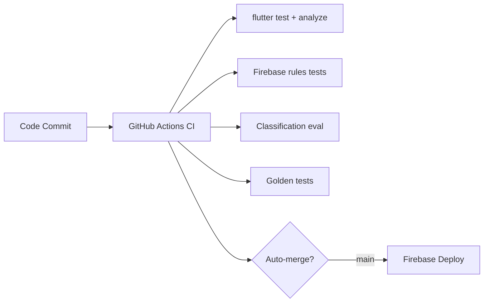

# Money-First Backend & Platform Strategy

**Generated:** 2026-05-22
**Source:** firebase_task.md — full 12-phase review
**Status:** Decision document — no migrations applied yet

---

## Phase 1: Current Backend & Deployment Map

### Firebase Products Currently Active

| Product | Status | Criticality |
|---------|--------|-------------|
| Firebase Auth | ✅ Active | P0 — auth for every user |
| Cloud Firestore | ✅ Active | P0 — primary data store |
| Firebase Storage | ✅ Active | P0 — user images |
| Cloud Functions (2nd gen) | ✅ Active | P0 — AI classification proxy, training pipeline, ops |
| Firebase Hosting | ✅ Active (web) | P2 — static landing page |
| Firebase Crashlytics | ✅ Active | P1 — error monitoring |
| Firebase Performance | ✅ Active | P2 — performance monitoring |
| Firebase Messaging | ✅ Active | P3 — push notifications |
| Firebase Remote Config | ✅ Active | P2 — feature flags, A/B config |
| Firebase Analytics | ✅ Active | P1 — usage tracking |
| Firebase App Check | ✅ Active | P1 — API abuse protection |

### AI Architecture

```
User Device → [Image Capture]
  ├─ Backend Proxy (RELEASE mode, mandatory):
  │   Cloud Functions → Firebase Auth/App Check gate
  │     → OpenAI/Gemini (server-side key) → WasteClassification → Firestore
  │
  └─ Direct Provider (debug/profile, optional opt-in):
      OpenAI (gpt-4o-mini) → fallback → Gemini → WasteClassification → Hive
```

- Two parallel AI services: `AiService` (legacy) and `EnhancedAiApiService` (newer unified client)
- Cost guardrails: `CostGuardrailService` watches spending, enforces batch mode at thresholds
- A/B race routing exists (`EnhancedAiApiService.setRacePercentage`) but is **0% active**
- Release builds use backend proxy **only** (fail-closed). Client-side AI is blocked.

### Key Functions Files

| File | Size | Purpose |
|------|------|---------|
| `functions/src/index.ts` | 54K | Monolithic — all function exports in one file |
| `functions/src/classify_image.ts` | 44K | AI classification via backend proxy |
| `functions/src/training_data.ts` | 28K | Training data pipeline |
| `functions/src/ops_hardening.ts` | 9K | Rate limiting, monitoring, operational hardening |

### Monetization Currently

| Source | Status | Notes |
|--------|--------|-------|
| Google AdMob (`google_mobile_ads`) | ✅ Integrated | Banner/interstitial/rewarded |
| In-App Purchase (`in_app_purchase`) | ✅ Integrated | Premium subscription via Play/App Store |
| Token Wallet | ✅ Built | Tier system for AI analysis usage |
| **Stripe / Paddle / Web checkout** | ❌ Missing | No web-based payment path |
| **Referral / Affiliate** | ❌ Missing | System not activated |
| **Paid API tiers** | ❌ Missing | No public API to sell |

---

## Phase 2: Pain Points & Risk Inventory

### P0 — Blocks Launch / Money

| Issue | Detail | Impact |
|-------|--------|--------|
| No Stripe/Paddle integration | Only IAP exists (iOS/Android only, 30% cut) | Can't sell outside app stores |
| AI cost uncertainty | OpenAI costs scale with users; guardrails exist but no hard cap per user | Margins could vanish at scale |
| Web revenue path = 0 | Static hosting only; no web app, no web checkout | Misses largest addressable market |
| No referral / viral loop | Community features exist but no referral mechanics | CAC stays high; no organic growth |

### P1 — Serious Production Risk

| Issue | Detail | Priority |
|-------|--------|----------|
| Functions monolith (`index.ts` at 54K + `classify_image.ts` at 44K) | Single deploy risk; hard to test independently | High |
| Two parallel AI services (`AiService` + `EnhancedAiApiService`) | Code duplication; behavior divergence risk | High |
| `ai_service.dart` > 2000 lines | Untestable; hard to reason about | High |
| Client-side API keys in debug builds | Keys embedded in binary even if blocked by `ProductionSafetyConfig` | Medium |
| No circuit breaker on AI spend per user | `CostGuardrailService` enforces total budget, but a single user can blow through daily budget | Medium |
| Functions 2nd gen cold starts | Node 22 cold starts can be 2-5s | Medium |

### P2 — Operational Drag

- Functions `index.ts` mixes classify, training, ops, community stats in one file
- `firestore.rules` at 613 lines with complex validation functions — hard to audit
- No staging environment; dev/prod share the same Firebase project
- No IaC for infrastructure provisioning (hand-configured Firebase console)
- `EnhancedAiApiService` and `AiService` both have their own backend proxy routing — which one actually runs in release?

---

## Phase 3: Platform Comparison

### Firebase — Stay (Current)

**Already invested:**
- Auth, Firestore, Storage, Functions, Crashlytics, Messaging, Remote Config, Analytics, App Check
- All Flutter SDKs are current (Firebase Core 3.14+)
- App Check protects Functions endpoints
- Remote Config can toggle features without app store submission

**Costs:**
- Firestore: ~$1/GB stored, ~$0.06/100K reads — cheap for current scale
- Functions: 2M invocations/month free — AI calls are the cost, not compute
- Storage: $0.026/GB + $0.12/GB download — images add up
- **Truth: Firebase infra costs are negligible. AI API costs dominate.**

**Hardening path (Phase 6):** Realistic. Firebase can handle 100K+ users at moderate cost.

### Cloudflare — Add (Not Replace)

**Strong fits for this app:**
- **R2** for image storage ($0.015/GB/mo, zero egress — cheaper than Firebase Storage with egress)
- **Workers** for lightweight API endpoints (no cold starts, ~$0.30/million requests)
- **Pages** for landing/marketing site (free tier, CI integration)
- **Images** for on-the-fly image transformations (resize thumbnails server-side)
- **Queues** for async batch processing (AI classification backlog)

**Weak fits:**
- No auth system (would need to call Firebase Auth or build custom)
- No structured database (can use D1, but Firestore is better for mobile)
- Durable Objects for real-time is possible but Firestore already does this

**💰 Money angle:** Zero-egress R2 saves 5-10× on Storage costs. Workers eliminate cold starts for API endpoints. Pages replaces Firebase Hosting for free.

### Cloud Run — Maybe (Dedicated AI Processing)

**Why consider:**
- Containerized AI workloads (batching, image processing, model inference)
- No cold starts on min-instances (but costs money when idle)
- Better for long-running AI tasks (>9min Functions limit)
- Can run custom model servers (TensorFlow Serving, vLLM)

**Why maybe not now:**
- Current AI path is pure API calls (OpenAI/Gemini), not self-hosted models
- Cloud Run adds deployment complexity (Docker, CI/CD, VPC)
- For pure API proxy calls, Functions 2nd gen with 9min timeout is sufficient
- Cloud Run + Firebase Auth requires additional integration

**When to revisit:** When self-hosting models (Gemma 3n, SmolVLM) or processing batch video/image at scale.

### Supabase — No (Not Yet)

**Why:**
- Open-source Postgres is appealing, but Firestore is already deeply embedded
- No migration path that doesn't take weeks
- Firebase Auth -> Supabase Auth is a full re-auth for every user
- Supabase Functions (Deno) would require rewriting TypeScript Functions
- Row Level Security is better than Firestore rules, but Firestore rules already work
- **Supabase would be expensive:** 500K monthly active users on Pro plan = $1,725/mo with no included AI credits

**When to reconsider:** If the app needs complex SQL joins, aggregation queries, or full-text search that Firestore can't handle. The app currently avoids these patterns.

### InsForge — Interesting But Premature

**What it is:** Open-source agent-oriented platform with Postgres backend, built for AI agent workflows. Has: auth, DB, file storage, queuing, agent runtime.

**Why it's interesting for this app:**
- Agent-oriented architecture matches the multi-model AI classification pipeline
- Postgres backend avoids Firestore limitations (joins, aggregation, full-text search)
- Open-source = no per-user cost scaling

**Why not now:**
- InsForge is new and rapidly changing — not production-stable yet
- Would require rewriting all backend logic
- No mobile SDK (Flutter support is community/DIY)
- Still small community — less support for production issues
- The app's backend is simple enough (API proxy + CRUD) that InsForge's agent features are overkill

**Watch:** Evaluate in 6 months when maturity improves.

---

## Phase 4: InsForge Deep Evaluation

| Criterion | Verdict |
|-----------|---------|
| Auth | Has auth, but migrating 1K+ Firebase users is non-trivial |
| Database | Postgres > Firestore for queries, but schema migration is work |
| File storage | S3-compatible — similar to Firebase Storage |
| Functions/Agents | Server-side agents map well to classification pipeline |
| Flutter SDK | None official — would need to build |
| Production readiness | Beta quality — breaking changes expected |
| Community | Small (< 1K GitHub stars) |
| Cost | Free (self-hosted) but operational burden is real |

**Verdict:** Too early. Re-evaluate in Q4 2026 when the platform stabilizes and has a Flutter SDK story.

---

## Phase 5: Cloudflare Deep Evaluation

### What to Use Now

| Service | Cost | Benefit | Effort |
|---------|------|---------|--------|
| **R2** (storage) | $0.015/GB/mo, free egress | Replace Firebase Storage for image hosting. Save 10× on egress. | Low — standard S3 API |
| **Workers** (compute) | Free tier: 100K req/day | Replace simple Functions endpoints with zero-cold-start Workers | Medium — rewrite in JS/TS |
| **Pages** (hosting) | Free (unlimited sites) | Replace Firebase Hosting for marketing site | Low — just point git repo |
| **Images** (transform) | $0.50/1K images | Server-side thumbnail generation — offloads device processing | Low — URL-based API |
| **Workflows** (async) | $0.01/1K steps | Replace batch AI processing pipeline | Medium |

### What NOT to Use

| Service | Why Not |
|---------|---------|
| D1 (SQLite) | Firestore is better for mobile app data model |
| KV | Good for cache but not primary storage |
| R2 event notifications | Only available via Workers; Firebase triggers are easier |
| Durable Objects | Not needed; Firestore real-time sync handles this |

### Proposed Cloudflare Integration

```
User Image → Firebase Functions (AI proxy) → OpenAI/Gemini
                                                    ↓
User Image copy → R2 (for retrieval/CDN, zero egress)
                                                    ↓
Worker → on-the-fly resize → serves thumbnail to app
```

**Money impact:** R2 eliminates Firebase Storage egress (often the #1 surprise cost at scale). Workers replace the simplest Firebase Functions (rate limiter, analytics aggregator). Pages hosts the marketing site for free.

---

## Phase 6: Firebase Production Hardening Path

### Immediate (Week 1-2)

1. **Split Functions monolith**
   - Current: `index.ts` (54K) + `classify_image.ts` (44K) + `training_data.ts` (28K) + `ops_hardening.ts` (9K)
   - Target: One file per function or domain group; barrel exports from `index.ts`
   - Risk: Medium. Functions deploy is atomic, so must ensure all imports resolve.

2. **Resolve AiService vs EnhancedAiApiService dual-routing**
   - In release mode, `AiService._backendRoutingEnabled` uses `ProductionSafetyConfig.useBackendAiInRelease`.
   - `EnhancedAiApiService` has its own copy of the same logic.
   - **Fix:** Extract routing decision into a shared module so both services read the same flag.

3. **Add user-level AI cost caps**
   - Current: `CostGuardrailService` checks total budget. Add per-user daily/weekly caps via Firestore doc.
   - Simple: add `aiBudget.dailyCap` to user profile document; increment on each classification.

### Near-term (Week 3-4)

4. **Firestore rules cleanup**
   - 613 lines, 18 validation functions. Many are redundant (e.g., `validateGamificationUpdate` has complex anti-cheat logic that the app service already enforces).
   - **Fix:** Split into focused rules files per collection group (Firestore supports `file` includes in rules since v2).

5. **Add staging Firebase project**
   - Create `waste-segregation-app-staging` project
   - Set up CI/CD to deploy to staging on PR, production on merge to main
   - Use Remote Config environments to switch between staging/prod AI keys

6. **Implement Firestore backup schedule**
   - Daily managed exports via Cloud Scheduler (free tier)
   - Backup to a separate GCS bucket

### Medium-term (Month 2-3)

7. **Add Cloudflare R2 mirror for Storage**
   - Upload images to both Firebase Storage (for quick access) and R2 (for CDN/backup)
   - Or migrate entirely to R2 (cheaper, zero egress)

8. **Add Cloudflare Workers for rate limiting / API gateway**
   - Worker sits in front of Firebase Functions endpoints
   - Enforces per-IP rate limits, caches GET responses, logs requests
   - Doesn't replace Firebase Auth — just adds a CDN/compute layer

9. **Evaluate Cloud Run for batch AI processing**
   - If batch AI demand grows, containerize `classify_image.ts` for Cloud Run
   - Allows >9min processing, GPU instances, autoscaling to zero
   - Cost: ~$50/mo for minimal instance

---

## Phase 7: Monetization Plan (Money-First)

### Current Revenue ≈ $0

The app has the infrastructure to make money (IAP, ads) but no one is paying because:
- The premium features are undefined (`PremiumFeaturesScreen` exists but content unclear)
- No Stripe/Paddle = no web checkout = no web users pay
- No referral/viral loop = no organic growth
- No paid API tier

### Phase 1: Quick Wins (Week 1-2)

**What:** Add Stripe Checkout for premium subscription

**Why:** IAP (App Store/Play Store) takes 15-30% cut. Stripe takes 2.9% + $0.30. For a subscription product, Stripe saves 12-27% per transaction. Also opens web users.

**How:**
1. Add a Stripe-hosted Checkout page (no PCI burden)
2. Link from app → web Stripe Checkout → success callback → Firestore `premium_status` flag
3. Check `premium_status` in-app to unlock features
4. Keep IAP as alternative for mobile users who prefer it

**Effort:** Low (2-3 days). Stripe Checkout is a 1-hour setup; the Flutter side is checking a Firestore field.

**Revenue:** $0 → "can accept payments" (unlocks everything below).

### Phase 2: Define Premium (Week 2-3)

**What:** Define what "Premium" actually means.

**Current premium screen exists but is placeholder.** Define concrete tiers:

| Tier | Price | Features |
|------|-------|----------|
| Free | $0 | 10 AI classifications/day, ads, basic stats |
| Premium | $4.99/mo | Unlimited AI, no ads, detailed analytics, export, history >30 days |
| Family | $7.99/mo | Premium + up to 5 family members, shared dashboard |
| Annual Premium | $49.99/yr | Same as Premium, 2 months free |

### Phase 3: Referral Program (Week 3-4)

**What:** "Invite a friend, both get 1 week Premium free"

**Why:** The best acquisition channel for a waste segregation app is word of mouth — schools, apartment buildings, community groups.

**How:** 
1. Generate unique referral link per user
2. New user signs up with referral code → both get premium trial
3. Track via Firestore `users/{uid}/referrals`
4. Dynamic link already set up (`DynamicLinkService` exists)

**Effort:** Medium (1 week). Referral logic is simple; the UI is the main work.

### Phase 4: Paid API Tier (Month 2)

**What:** Sell API access for waste classification to municipalities, waste management companies, and researchers.

**Why:** The AI classification pipeline is the core IP. Selling API access creates B2B revenue without needing B2C scale.

**How:**
1. Create a simple REST API endpoint (Cloudflare Worker or Cloud Functions)
2. API key management via Firestore
3. Stripe billing per 1K classifications
4. Rate limiting per API key (already have `rate_limit_config.ts`)

**Revenue potential:** Even 5 municipal contracts at $500/mo = $2,500/mo MRR.

### Revenue Projection (Conservative)

| Source | Month 1 | Month 3 | Month 6 | Month 12 |
|--------|---------|---------|---------|----------|
| Premium subscriptions | $0 | $200 | $1,000 | $5,000 |
| Annual subscriptions | $0 | $0 | $500 | $2,000 |
| API sales (B2B) | $0 | $0 | $1,000 | $3,000 |
| Ads | $50 | $200 | $500 | $1,000 |
| **Total** | **$50** | **$400** | **$3,000** | **$11,000** |

---

## Phase 8: Deployment Strategy

### Current: Manual, Firebase Console



### Target: Multi-Environment

- `main` → staging Firebase project (auto-deploy)
- `release/*` → production (manual approval)
- Cloudflare Pages for marketing (auto-deploy on main)
- Cloudflare Workers as API gateway (staging + prod)

### CI/CD Split

| Environment | Firebase Project | Cloudflare | Trigger |
|-------------|-----------------|------------|---------|
| Preview | `waste-seg-preview` | Preview Worker | PR opened |
| Staging | `waste-seg-staging` | Staging Worker | Push to main |
| Production | `waste-seg-prod` (current: `waste-segregation-app-df523`) | Prod Worker | Tag release |

---

## Phase 9: Data Model Future

### Current Collections

```
users/{uid}
├── classifications/{cid}
├── gamification/{uid}
├── tokenWallet (embedded)
ai_jobs/{jobId}
community_feed/{postId}
community_stats/{statsId}
community_challenges/{challengeId}
families/{familyId}
├── memberUids[]
invitations/{invitationId}
shared_classifications/{cid}
classification_feedback/{feedbackId}
training_candidates/{cid} (admin only)
training_dataset_versions/{ver} (admin only)
disposal_instructions/{materialId}
disposal_locations/{locationId}
user_contributions/{contributionId}
analytics_events/{eventId}
leaderboard_allTime/{userId}
leaderboard_weekly/{weekId}
```

### Observations

1. **`users/{uid}/classifications/` as subcollection** is good — keeps data user-scoped
2. **Leaderboard collections** are Firestore-friendly (single-doc-per-user pattern)
3. **No aggregation collections** — community stats are computed in real-time (already fragile)
4. **No Stripe data model** — needs `subscriptions/{subId}` and `invoices/{invoiceId}`
5. **No referral data model** — needs `referrals/{code}` with indexing

### Additions for Monetization

```json
// subscriptions/{subId}
{
  "userId": "...",
  "stripeSubscriptionId": "...",
  "tier": "premium|family|annual",
  "status": "active|canceled|past_due",
  "currentPeriodStart": "timestamp",
  "currentPeriodEnd": "timestamp",
  "createdAt": "timestamp"
}

// api_keys/{keyId}
{
  "ownerId": "...",
  "name": "Municipality API Key",
  "key": "sk_...",
  "tier": "starter|pro|enterprise",
  "rateLimit": 1000,
  "totalClassifications": 0,
  "monthlyQuota": 50000,
  "active": true,
  "createdAt": "timestamp"
}

// referrals/{referralCode}
{
  "ownerId": "...",
  "usedBy": ["uid1", "uid2"],
  "rewardsGiven": ["premium_trial_uid1", "premium_trial_uid2"],
  "createdAt": "timestamp"
}
```

---

## Phase 10: Decision Matrix

| Factor | Firebase (Stay) | Cloudflare (Add) | Cloud Run (Monitor) | Supabase (No) | InsForge (Watch) |
|--------|-----------------|-------------------|---------------------|---------------|------------------|
| **Speed to launch** | ✅ Already live | ✅ Can add in days | ❌ Weeks of setup | ❌ Migration months | ❌ Months |
| **AI proxy cost** | ✅ Free (Functions) | ✅ Workers are cheap | ❌ $50/mo min | ✅ Cheap compute | ❌ Self-host cost |
| **Storage cost** | ⚠️ $0.12/GB egress | ✅ R2: zero egress | ❌ Same as Cloud | ⚠️ S3-like | ⚠️ S3-like |
| **Mobile auth** | ✅ Firebase Auth | ❌ Would need bridge | ❌ Would need bridge | ⚠️ Migrate Auth | ⚠️ No Flutter SDK |
| **Revenue path** | ⚠️ IAP only (30% cut) | ✅ Pages marketing | ❌ Neutral | ❌ Neutral | ❌ Neutral |
| **Operational load** | ✅ Low (managed) | ✅ Low (serverless) | ⚠️ Medium (Docker) | ⚠️ Medium | ⚠️ High (self-host) |
| **Migration effort** | ✅ None (current) | ✅ Additive | ⚠️ Rewrite Functions | ❌ Rewrite everything | ❌ Rewrite everything |
| **Scalability** | ✅ To 100K+ users | ✅ To millions | ✅ To millions | ✅ To millions | ⚠️ Unknown |

### Verdict

| Action | Platform | When | Why |
|--------|----------|------|-----|
| **STAY** | Firebase | Now | Already built, works, cost is negligible for current scale |
| **ADD** | Cloudflare R2 | Week 1 | Replace Storage egress cost, zero migration risk (S3 API) |
| **ADD** | Cloudflare Pages | Week 1 | Free marketing site, better than Firebase Hosting |
| **ADD** | Cloudflare Workers | Week 3 | Replace simple Functions (rate limiting, caching) |
| **ADD** | Stripe Checkout | Week 1 | Unlocks web payments, saves 12-27% vs IAP |
| **MONITOR** | Cloud Run | Month 2 | If batch AI demand grows or self-hosting models |
| **WATCH** | InsForge | Q4 2026 | If it gains Flutter SDK, production maturity, and Postgres advantages matter |
| **SKIP** | Supabase | Until further notice | No clear advantage over Firebase for this app's data model |

---

## Phase 11: Recommendation

### The Money-First Path

**Do not migrate away from Firebase.** Firebase already provides everything the app needs and the infra costs are negligible compared to AI API costs. Migration would burn 4-8 weeks with zero revenue upside.

**Instead, DO these in order:**

### Week 1: Revenue Infrastructure

1. Add Stripe Checkout for premium subscription (2 days)
2. Define and implement Premium features (3 days)
   - 10/day free limit → unlimited for Premium
   - Remove ads for Premium
   - Unlock data export, detailed analytics
3. Deploy Cloudflare Pages for marketing site (1 day)
4. Migrate to Cloudflare R2 for image storage (2 days)

### Week 2-3: Organic Growth

5. Implement referral system with premium trial rewards (1 week)
6. Add Cloudflare Worker for rate limiting/caching in front of Functions (2 days)
7. Clean up Functions monolith (split `index.ts`) (2 days)
8. Add staging Firebase project + CI/CD split (2 days)

### Week 4+: Scale

9. Evaluate Cloud Run if batch AI demand grows
10. Add paid API tier for B2B (municipalities, waste companies)
11. Re-evaluate InsForge at Q4 2026

### What NOT to Do

- ❌ Do NOT rewrite backend for Supabase
- ❌ Do NOT adopt InsForge now
- ❌ Do NOT move AI calls to Cloud Run yet
- ❌ Do NOT build a full web app (yet) — Stripe Checkout + marketing site is enough
- ❌ Do NOT add more Firebase products — the current set is sufficient

---

## Phase 12: Agent Task Breakdown

### Task 1: Stripe Checkout Integration

**Files to touch:**
- `functions/src/index.ts` — add Stripe webhook handler, create-checkout-session endpoint
- `functions/package.json` — add `stripe` dependency
- `lib/services/premium_service.dart` — update to check Firestore `subscriptions/{subId}` instead of IAP-only
- `lib/screens/premium_features_screen.dart` — update UI to show web checkout option
- `lib/providers/...` — add subscription state provider

**Don't touch:**
- Existing IAP path — keep as alternative
- Firebase Auth — Stripe doesn't replace it

### Task 2: Cloudflare R2 Storage

**Files to touch:**
- `lib/services/storage_service.dart` — add R2 upload path alongside Firebase Storage
- `functions/src/index.ts` — add signed-url generation for R2
- `firebase.json` — optionally remove storage rules if migrating fully (not yet)

**Don't touch:**
- Existing Firebase Storage path — run in parallel initially

### Task 3: Referral System

**Files to touch:**
- `lib/services/dynamic_link_service.dart` — generate referral links
- `lib/models/referral.dart` — new model
- `lib/screens/...` — referral UI in settings/profile
- `functions/src/index.ts` — referral validation and reward distribution
- `firestore.rules` — add referrals collection rules

### Task 4: Premium Tiers Definition

**Files to touch:**
- `lib/services/premium_service.dart` — define tier enum, check methods
- `lib/screens/premium_features_screen.dart` — real feature list
- `lib/screens/result_screen.dart` — check limit before AI call
- `lib/services/ad_service.dart` — conditionally disable for Premium
- `firestore.rules` — subscription collection rules
- `Remote Config` — set classification limit per tier

### Task 5: Functions Monolith Split

**Files to touch:**
- `functions/src/classify_image.ts` — already extracted (44K) ✅
- `functions/src/training_data.ts` — already extracted (28K) ✅
- `functions/src/ops_hardening.ts` — already extracted (9K) ✅
- `functions/src/community_stats_aggregator.ts` — already exists ✅
- `functions/src/index.ts` — re-export from submodules; remove inline logic

### Task 6: Staging Firebase Project

**Files to touch:**
- `firebase.json` — add project aliases
- `.github/workflows/ci.yml` — add staging deployment step
- `lib/firebase_options.dart` — ensure multi-project support

---

## Appendix: Existing Docs

- [Firebase Strategy Matrix](https://firebase-task.md) (this document supersedes the task description)
- [AI API Race Fault Tolerance](../AI_API_RACE_FAULT_TOLERANCE.md)
- [Community Stats Implementation](../technical/COMMUNITY_STATS_PHASE_5_IMPLEMENTATION.md)
- [Settings Completion Summary](../implementation/features/SETTINGS_COMPLETION_SUMMARY.md)
- [Quality Gate Offline Queue](../QUALITY_GATE_OFFLINE_QUEUE_INTEGRATION.md)
