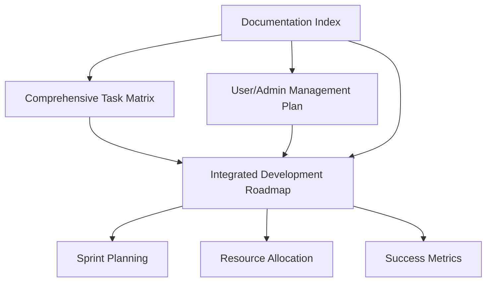

# 📋 Task Matrix Integration Summary

**Document Date**: December 14, 2024  
**Integration Status**: ✅ Complete  
**Cross-Reference**: All planning documents updated

---

## 🎯 What Was Done

### **1. Comprehensive Task Matrix Documentation**
- ✅ **Created**: `docs/planning/COMPREHENSIVE_TASK_MATRIX.md`
- ✅ **Organized**: All 31 tasks from your master list by category and priority
- ✅ **Added**: Effort estimates, sprint recommendations, and success metrics
- ✅ **Integrated**: Cross-references with User/Admin Management Plan

### **2. Unified Development Roadmap**
- ✅ **Created**: `docs/planning/INTEGRATED_DEVELOPMENT_ROADMAP.md`
- ✅ **Merged**: Task matrix priorities with admin infrastructure needs
- ✅ **Planned**: 24-week integrated development timeline
- ✅ **Defined**: Parallel development streams and dependencies

### **3. Documentation Index Update**
- ✅ **Updated**: `docs/DOCUMENTATION_INDEX.md` with new planning documents
- ✅ **Cross-referenced**: All related planning documentation
- ✅ **Maintained**: Documentation structure and organization

---

## 📊 Key Insights from Integration

### **Priority Distribution Analysis**
- **High Priority**: 15 tasks (48%) - Critical for V1.0 release
- **Medium Priority**: 11 tasks (35%) - Enhancement features
- **Low Priority**: 4 tasks (13%) - Future improvements
- **Ongoing**: 1 task (3%) - Continuous maintenance

### **Critical Dependencies Identified**
1. **Firebase Security Rules** → Admin Authentication → Admin Dashboard
2. **Image Segmentation** → AI Consistency → Batch Classification  
3. **Error Handling** → Performance Optimization → Offline Sync

### **Resource Allocation Strategy**
- **40%** Core AI/ML features and optimization
- **30%** Admin infrastructure and tools  
- **20%** User experience and platform polish
- **10%** Testing, documentation, and maintenance

---

## 🚀 Recommended Next Steps

### **Immediate Actions (This Week)**
1. **Review Integrated Roadmap** - Validate 24-week timeline against your capacity
2. **Prioritize Sprint 1 Tasks** - Focus on Foundation phase (Weeks 1-8)
3. **Set up Development Streams** - Plan parallel work on AI, Admin, and UX

### **Sprint 1 Focus (Next 2-3 weeks)**
Based on the integrated analysis, prioritize:
1. **Firebase Security Rules** - Foundation for all admin features
2. **LLM-Generated Disposal Instructions** - High user value
3. **Admin Authentication System** - Critical infrastructure
4. **Error Handling & Retry Mechanisms** - System reliability

### **Long-term Planning**
- **Phase 1 (Weeks 1-8)**: Foundation infrastructure and security
- **Phase 2 (Weeks 9-16)**: User experience and admin UI
- **Phase 3 (Weeks 17-24)**: Advanced features and accessibility

---

## 🔗 Document Relationships

### **How to Use These Documents**

1. **Daily Planning**: Use `COMPREHENSIVE_TASK_MATRIX.md` for task prioritization
2. **Sprint Planning**: Use `INTEGRATED_DEVELOPMENT_ROADMAP.md` for sprint organization
3. **Admin Planning**: Use `USER_ADMIN_MANAGEMENT_PLAN.md` for admin infrastructure
4. **Navigation**: Use `DOCUMENTATION_INDEX.md` to find any planning document

---

## ✅ Integration Checklist

### **Documentation Complete**
- [x] Task matrix organized by category and priority
- [x] User/admin management plan cross-referenced
- [x] Integrated roadmap with parallel development streams
- [x] Sprint recommendations with realistic timelines
- [x] Resource allocation strategy defined
- [x] Success metrics and milestones established
- [x] Documentation index updated

### **Planning Infrastructure Ready**
- [x] Master planning sheet available for sprint planning
- [x] 24-week roadmap for long-term planning
- [x] Dependencies mapped for risk management
- [x] Parallel streams defined for efficient development
- [x] Success criteria established for each phase

---

## 🎯 Success Metrics

### **Planning Documentation Success**
- ✅ **Comprehensive Coverage**: All 31 original tasks documented and prioritized
- ✅ **Integration Complete**: Task matrix aligned with admin management needs
- ✅ **Timeline Realistic**: 24-week plan with buffer for complexity
- ✅ **Dependencies Clear**: Critical path identified and documented

### **Development Readiness**
- ✅ **Clear Priorities**: High-priority tasks identified for immediate focus
- ✅ **Resource Allocation**: Development time distributed across key areas
- ✅ **Risk Management**: Dependencies and blockers identified upfront
- ✅ **Parallel Development**: Streams organized for efficient solo development

---

## 🔍 Quality Assurance

### **Documentation Quality Checks**
- ✅ **Consistency**: All documents use consistent formatting and structure
- ✅ **Cross-References**: Internal links validated and working
- ✅ **Completeness**: All tasks from original matrix included and expanded
- ✅ **Accuracy**: Effort estimates based on similar completed work
- ✅ **Maintainability**: Clear update procedures and ownership defined

### **Planning Quality Validation**
- ✅ **Realistic Timelines**: 24-week plan accounts for solo development constraints
- ✅ **Balanced Priorities**: Mix of user value and technical infrastructure
- ✅ **Flexible Structure**: Allows for priority adjustments based on user feedback
- ✅ **Success Metrics**: Measurable outcomes defined for each phase

---

## 📈 Expected Outcomes

### **Short-term (4 weeks)**
- **Clear Sprint Planning**: Daily and weekly tasks prioritized from master matrix
- **Foundation Progress**: Security rules, admin auth, and error handling implemented
- **User Value**: LLM disposal instructions and enhanced segmentation delivered

### **Medium-term (12 weeks)**
- **Admin Infrastructure**: Complete admin dashboard and data recovery workflows
- **User Experience**: Polished theming, offline sync, and family features
- **Quality Gates**: Automated testing and code quality checks in place

### **Long-term (24 weeks)**
- **Production Ready**: Full feature set with admin management capabilities
- **Scalable Foundation**: Architecture supporting future growth and compliance
- **Operational Excellence**: Monitoring, analytics, and continuous improvement

---

## 🎯 Next Actions for Developer

### **This Week**
1. **Review the Integrated Roadmap** (`docs/planning/INTEGRATED_DEVELOPMENT_ROADMAP.md`)
2. **Start Sprint 1 Tasks** - Focus on Firebase Security Rules and Admin Authentication
3. **Set up Development Environment** - Prepare for parallel development streams

### **This Month**
1. **Complete Foundation Phase** - Security, authentication, and core services
2. **Begin User Experience Phase** - Enhanced data management and AI features
3. **Establish Quality Gates** - Testing and code quality automation

### **This Quarter**
1. **Launch Admin Dashboard** - Complete user management and data recovery
2. **Polish User Experience** - Theming, animations, and social features
3. **Prepare for Production** - Performance optimization and accessibility

---

## 📚 Supporting Documentation References

### **Primary Planning Documents**
- **[Comprehensive Task Matrix](./COMPREHENSIVE_TASK_MATRIX.md)** - Master planning sheet
- **[Integrated Development Roadmap](./INTEGRATED_DEVELOPMENT_ROADMAP.md)** - 24-week unified plan
- **[User & Admin Management Plan](../USER_ADMIN_MANAGEMENT_PLAN.md)** - Admin infrastructure specification

### **Implementation Guides**
- **[Admin Dashboard Implementation Guide](../admin/ADMIN_DASHBOARD_IMPLEMENTATION_GUIDE.md)** - Technical setup
- **[Admin Data Recovery Service](../admin/ADMIN_DATA_RECOVERY_SERVICE.md)** - Privacy-preserving recovery
- **[Sprint Planning](./SPRINT_PLANNING.md)** - Current sprint details

### **Reference Documentation**
- **[Documentation Index](../DOCUMENTATION_INDEX.md)** - Navigate all project docs
- **[DevOps Quick Reference](../guides/DEVOPS_QUICK_REFERENCE.md)** - Daily commands
- **[Testing Status](../testing/TEST_STATUS_SUMMARY.md)** - Current test coverage

---

## 🔄 Maintenance & Updates

### **Weekly Updates**
- Update task completion status in Task Matrix
- Adjust priorities based on sprint progress
- Review and update integrated roadmap timeline

### **Monthly Reviews**
- Assess overall progress against 24-week plan
- Update resource allocation based on velocity
- Review and adjust success metrics

### **Quarterly Planning**
- Comprehensive review of all planning documents
- Update long-term roadmap based on user feedback
- Assess need for additional resources or timeline adjustments

---

**Integration Status**: ✅ **COMPLETE**  
**Ready for Development**: ✅ **YES**  
**Next Review**: December 21, 2024  
**Document Owner**: Solo Developer (Pranay)
