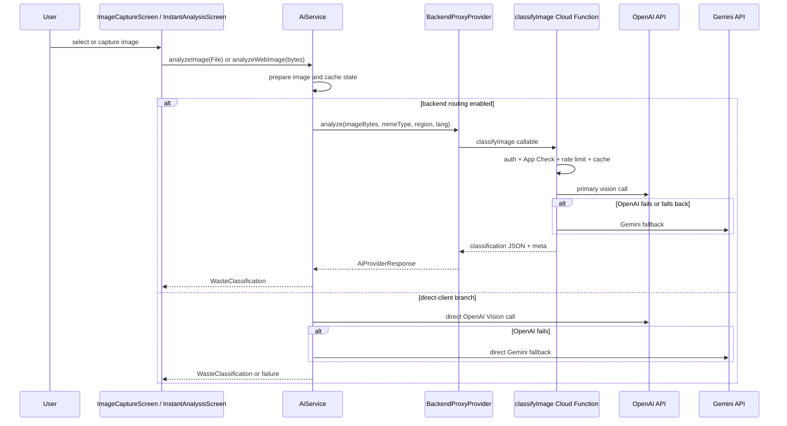

# AI Pipeline Truth Map
**Date**: 2026-05-21
**Author**: Generated by AI pipeline audit
**Scope**: Every AI entry point in the waste_segregation_app codebase, citation-accurate

---

## 1. Executive Summary

- **Classification now routes through a secure backend proxy in release.** `AiService` checks `kReleaseMode || ProductionSafetyConfig.useBackendAiInRelease || BackendProxyProvider.isEnabled` and routes classification to `classifyImage` through `BackendProxyProvider` when the backend path is enabled. Release is fail-closed to the backend path; debug/profile can opt in via `USE_BACKEND_AI_IN_RELEASE`.
- **Direct OpenAI and Gemini clients still exist.** They are still used in debug/profile unless the backend proxy is enabled, and they remain available as direct provider paths in `EnhancedAiApiService`. That service still does not apply the same production-safety guard as `AiService`.
- **Disposal instructions remain backend-first.** `generateDisposal` in `functions/src/index.ts` is still the separate backend AI path and continues to be the canonical text-only guidance flow.
- **On-device inference is still scaffolded, not real.** `OnDeviceVisionService` remains a placeholder and does not run actual TFLite inference.
- **Cost control is now split.** Client-side token/premium rules still gate UX, but classification also has a server-side callable gate with auth, App Check support, Firestore caching, and per-UID rate limiting.

---

## 2. Entry Points Inventory

| # | Method | File | Line | Calls AI Provider | Build Modes Active | Guards |
|---|--------|------|------|-------------------|-------------------|--------|
| 1 | `AiService.analyzeImage()` | `lib/services/ai_service.dart` | 727 | Backend proxy in release and when backend routing is enabled; otherwise OpenAI primary -> Gemini fallback | release always uses backend proxy route; debug/profile can opt in | `ProductionSafetyConfig.guardClientAiCall()` on direct provider branches; backend route uses `BackendProxyProvider` |
| 2 | `AiService.analyzeWebImage()` | `lib/services/ai_service.dart` | 890 | same routing as above | same as above | same guards |
| 3 | `AiService.analyzeImageRegions()` | `lib/services/ai_service.dart` | 1059 | Backend proxy or OpenAI-only region path depending on routing | same as above | inherited |
| 4 | `AiService.handleUserCorrection()` | `lib/services/ai_service.dart` | 1572 | OpenAI or Gemini, but only on direct-client branches | same as above | `guardClientAiCall('AI correction')` on direct path |
| 5 | `BackendProxyProvider.analyze()` | `lib/services/providers/backend_proxy_provider.dart` | 1 | Firebase callable -> `classifyImage` Cloud Function | release and opt-in debug/profile | Firebase Auth, App Check when enabled server-side, server rate limit |
| 6 | `DisposalInstructionsService._generateViaCloudFunction()` | `lib/services/disposal_instructions_service.dart` | ~155 | Firebase Cloud Function -> OpenAI `gpt-4` text-only call | all modes | Firebase Auth bearer token required; App Check optional |
| 7 | `EnhancedAiApiService.analyzeWasteImage()` | `lib/services/enhanced_ai_api_service.dart` | 78 | OpenAI or Gemini per model selection | all modes | no `guardClientAiCall()` call |
| 8 | `EnhancedAiApiService.analyzeWithRace()` | `lib/services/enhanced_ai_api_service.dart` | 181 | OpenAI and Gemini in parallel | all modes | no production safety guard |
| 9 | `OnDeviceVisionService.analyzeImage()` | `lib/services/on_device_vision_service.dart` | 143 | None - placeholder stub | all modes | no AI call; purely local |
| 10 | `OfflineQueueService` retry path | `lib/services/offline_queue_service.dart` | 267 | `EnhancedAiApiService.analyzeWasteImage()` | all modes | inherits the direct-service gap |

---

## 3. Classification Flow

---

## 4. Build Mode Behavior

| Mode | Classification path | Disposal path | Notes |
|---|---|---|---|
| Debug | Direct client allowed by default; backend proxy can be enabled with `USE_BACKEND_AI_IN_RELEASE=true` | Allowed | Best for local iteration |
| Profile | Direct client allowed by default; backend proxy can be enabled with `USE_BACKEND_AI_IN_RELEASE=true` | Allowed | Same as debug for routing |
| Release | Backend proxy route is the canonical path | Allowed | Fail-closed to the backend classification path |
| Release + legacy direct override | Direct client path is still guarded by `ProductionSafetyConfig` and is not the canonical route | Allowed | Keep only for controlled transition cases |

---

## 5. Provider Routing Matrix

### Image Classification

| Condition | Provider Used | Model |
|---|---|---|
| Release or backend routing enabled | Firebase backend proxy -> `classifyImage` | server-side OpenAI primary, Gemini fallback |
| Debug/profile default | OpenAI primary | `ApiConfig.primaryModel` |
| Direct OpenAI failure with fallback condition | Gemini | `ApiConfig.tertiaryModel` |
| OpenAI terminal failure kinds (`cancelled`, `auth`, `budgetExceeded`, `unsafeClientAiBlocked`) | No fallback | rethrows |
| Offline queue retry path | `EnhancedAiApiService` direct provider chain | model selection service chain |

### Disposal Instructions

| Condition | Source |
|---|---|
| In-memory cache hit | `cache_local` |
| Firestore cache hit | `disposal_instructions_firestore` |
| Neither cache hit | `generateDisposal` -> OpenAI `gpt-4` |
| Cloud Function failure | static fallback instructions |

---

## 6. Stale Documentation List

| Document | Stale Claim | Reality |
|---|---|---|
| `docs/implementation/ai/api_key_management_and_security.md` | Classification is fully client-side and `classifyImage` is aspirational only | `classifyImage` now exists in `functions/src/classify_image.ts` and is exported from `functions/src/index.ts` |
| `docs/implementation/ai/api_key_management_and_security.md` | `USE_BACKEND_AI_IN_RELEASE` is dead | `AiService` consumes backend routing flags and routes through the backend proxy in release |
| `docs/architecture/CURRENT_AI_ARCHITECTURE.md` | No backend classification function exists | Backend classification proxy exists and is part of the release path |
| `docs/review/BACKEND_GATEWAY_IMPLEMENTATION_NOTES_2026-05-21.md` before this rewrite | Phase 2 wiring was pending | Backend proxy wiring is now live in `AiService` |

---

## 7. Gaps and Missing Pieces

| Gap | Where It Should Exist | What Is Actually There |
|---|---|---|
| Direct-client safety parity for `EnhancedAiApiService` | `lib/services/enhanced_ai_api_service.dart` | Still no `guardClientAiCall()` call |
| On-device TFLite inference | `lib/services/on_device_vision_service.dart` | Still a placeholder stub |
| Daily quota on top of per-UID callable limit | `functions/src/classify_image.ts` or a shared rate-limit module | Not implemented yet |
| Server-side premium verification for token debit | `functions/src/index.ts` `spendUserTokens` | Still trusted client amount flow |

---

## 8. Future State Summary

The current architecture is already better than the old client-only story, but it still has a clear next hardening step: make every non-debug classification request use the backend proxy, and then bring the remaining direct-client surfaces under the same safety and telemetry rules. On-device inference can stay deferred until the real TFLite path exists.
