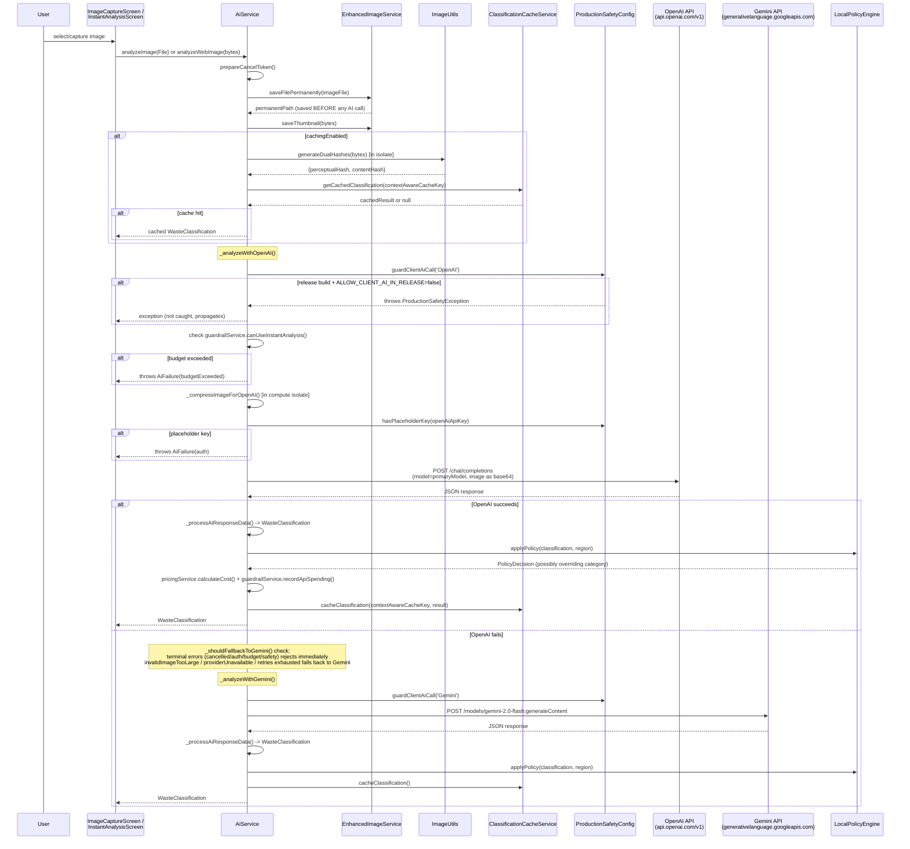
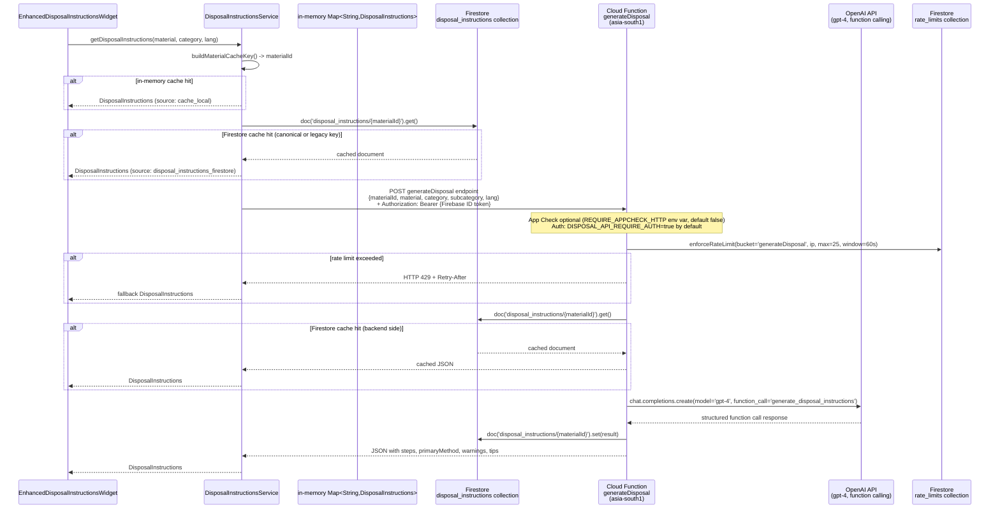

# AI Pipeline Truth Map
**Date**: 2026-05-21
**Author**: Generated by AI pipeline audit
**Scope**: Every AI entry point in the waste_segregation_app codebase, citation-accurate

---

## 1. Executive Summary

- **Classification is 100% client-side.** The Flutter app calls OpenAI and Gemini directly over HTTP using Dio. There is no `classifyImage` Cloud Function — that does not exist in `functions/src/index.ts`. The existing doc `docs/implementation/ai/api_key_management_and_security.md` shows a `classifyImage` Cloud Function as example code; it is aspirational pseudocode, not deployed code.
- **Release builds are blocked by default.** `ProductionSafetyConfig.guardClientAiCall()` throws `ProductionSafetyException` in release mode unless the build flag `ALLOW_CLIENT_AI_IN_RELEASE=true` is set at compile time (`lib/utils/production_safety_config.dart:54`). There is a forward-compat flag `USE_BACKEND_AI_IN_RELEASE` that is defined but **never consumed** anywhere — no code reads it to route to a backend.
- **Two parallel AI service implementations coexist.** `AiService` (`lib/services/ai_service.dart`, 2562 lines) is the one actually wired into screens. `EnhancedAiApiService` (`lib/services/enhanced_ai_api_service.dart`) is only reached via `OfflineQueueService` and the unused `ApiManagementService`; it does not apply production safety guards.
- **Disposal instructions are the only backend AI path.** `generateDisposal` (Cloud Function, `functions/src/index.ts:207`) calls `gpt-4` (text-only, function calling) and caches results in Firestore `disposal_instructions`. Rate limit: 25 req/60 s per IP, token-bucket in Firestore `rate_limits`.
- **On-device inference is a scaffold, not functional.** `OnDeviceVisionService` (`lib/services/on_device_vision_service.dart:142`) returns a placeholder `WasteClassification` with a TODO comment. TFLite model files are referenced but inference is not implemented. This service is not connected to any production screen path.

---

## 2. Entry Points Inventory

| # | Method | File | Line | Calls AI Provider | Build Modes Active | Guards |
|---|--------|------|------|-------------------|-------------------|--------|
| 1 | `AiService.analyzeImage()` | `lib/services/ai_service.dart` | 727 | OpenAI primary → Gemini fallback | debug/profile always; release only if `ALLOW_CLIENT_AI_IN_RELEASE=true` | `ProductionSafetyConfig.guardClientAiCall()` at line 1201 (OpenAI) and 1377 (Gemini); placeholder key check at lines 1222 and 1396 |
| 2 | `AiService.analyzeWebImage()` | `lib/services/ai_service.dart` | 890 | OpenAI primary → Gemini fallback | same as above | same guards |
| 3 | `AiService.analyzeImageRegions()` | `lib/services/ai_service.dart` | 1059 | OpenAI only (via `_analyzeSingleRegion`) | same as above | inherited — calls `_analyzeWithOpenAI` which calls `guardClientAiCall` |
| 4 | `AiService.analyzeImageRegion()` (mobile single region) | `lib/services/ai_service.dart` | 1098 | OpenAI only | same as above | inherited |
| 5 | `AiService.analyzeWebImageRegion()` (web single region) | `lib/services/ai_service.dart` | 1117 | OpenAI only | same as above | inherited |
| 6 | `AiService.handleUserCorrection()` | `lib/services/ai_service.dart` | 1572 | OpenAI or Gemini (based on original classification source) | same as above | `guardClientAiCall('AI correction')` at line 1579 |
| 7 | `DisposalInstructionsService._generateViaCloudFunction()` | `lib/services/disposal_instructions_service.dart` | ~155 | Firebase Cloud Function → OpenAI `gpt-4` | all modes (no client AI guard — goes via HTTPS to backend) | Firebase Auth Bearer token required (configurable); App Check optional |
| 8 | `EnhancedAiApiService.analyzeWasteImage()` | `lib/services/enhanced_ai_api_service.dart` | 78 | OpenAI or Gemini per model selection | all modes (**no production safety guard**) | Placeholder key not checked; `guardClientAiCall` not called |
| 9 | `EnhancedAiApiService.analyzeWithRace()` | `lib/services/enhanced_ai_api_service.dart` | 181 | OpenAI AND Gemini in parallel (race) | all modes (**no production safety guard**) | none |
| 10 | `AiService.segmentImage()` | `lib/services/ai_service.dart` | 2484 | OpenAI (grid segmentation) | debug only — gated by `ENABLE_DEBUG_GRID_SEGMENTATION` compile flag (line 86) | guard inherited from `_analyzeWithOpenAI` |
| 11 | `OnDeviceVisionService.analyzeImage()` | `lib/services/on_device_vision_service.dart` | 143 | None — placeholder stub, returns dummy classification | all modes | no AI call; purely local |

**Caller map (which screens reach which entry points):**

| Screen | Entry Point Called |
|--------|-------------------|
| `ImageCaptureScreen` (`lib/screens/image_capture_screen.dart:441`) | `AiService.analyzeImage()` (line 724), `AiService.analyzeWebImage()` (lines 634, 670), `AiService.analyzeImageRegions()` (lines 615, 661, 705, 1586) |
| `InstantAnalysisScreen` (`lib/screens/instant_analysis_screen.dart:41`) | `AiService.analyzeWebImage()` (line 61), `AiService.analyzeImage()` (line 68) |
| `ResultScreen` (`lib/screens/result_screen.dart:936`) | `AiService.handleUserCorrection()` |
| `OfflineQueueService` (`lib/services/offline_queue_service.dart:267`) | `EnhancedAiApiService.analyzeWasteImage()` — offline queue retry path only |

---

## 3. Classification Flow (Mermaid Sequence Diagram)

---

## 4. Disposal Flow (Mermaid Sequence Diagram)

---

## 5. Build Mode Matrix

| AI Path | Debug Build | Profile Build | Release Build (default) | Release + `ALLOW_CLIENT_AI_IN_RELEASE=true` |
|---------|-------------|---------------|------------------------|---------------------------------------------|
| `AiService._analyzeWithOpenAI()` | Allowed | Allowed | **BLOCKED** — throws `ProductionSafetyException` | Allowed |
| `AiService._analyzeWithGemini()` | Allowed | Allowed | **BLOCKED** — throws `ProductionSafetyException` | Allowed |
| `AiService.handleUserCorrection()` (OpenAI/Gemini) | Allowed | Allowed | **BLOCKED** | Allowed |
| `EnhancedAiApiService.analyzeWasteImage()` | Allowed | Allowed | **Allowed (no guard)** — security gap | Allowed |
| `EnhancedAiApiService.analyzeWithRace()` | Allowed | Allowed | **Allowed (no guard)** — security gap | Allowed |
| `DisposalInstructionsService` via Cloud Function | Allowed | Allowed | Allowed | Allowed |
| `AiService.segmentImage()` | Allowed (if `ENABLE_DEBUG_GRID_SEGMENTATION=true`) | Blocked (flag off) | Blocked (flag off) | Blocked (flag off) |
| `OnDeviceVisionService` | No-op stub | No-op stub | No-op stub | No-op stub |

**Guard mechanism detail** (`lib/utils/production_safety_config.dart`):
- `isClientAiAllowed`: returns `true` if `!kReleaseMode` OR `_allowClientAiInRelease == true` (lines 20-23)
- `guardClientAiCall(label)`: throws `ProductionSafetyException` if `!isClientAiAllowed` (lines 54-66)
- `hasPlaceholderKey(key)`: returns true for empty, `your-openai-api-key-here`, `your-gemini-api-key-here`, `your-api-key-here`, or any key starting with `your-` (lines 33-40)
- `useBackendAiInRelease`: defined at line 28 as a compile-time constant but **never read anywhere in the codebase** — dead flag

---

## 6. Provider Routing Matrix

### Image Classification (AiService — production path)

| Condition | Provider Used | Model |
|-----------|---------------|-------|
| Normal request, cost optimization enabled, no segmentation | OpenAI | `ApiConfig.primaryModel` (default: `gpt-4.1-nano` via `OPENAI_API_MODEL_PRIMARY`) |
| Normal request, cost optimization enabled, segmentation | OpenAI | `ApiConfig.primaryModel` |
| Budget guardrail triggered (`canUseInstantAnalysis` returns false) | None — throws `AiFailure(budgetExceeded)` | — |
| OpenAI fails with `invalidImageTooLarge` or `providerUnavailable` | Gemini (fallback) | `ApiConfig.tertiaryModel` (default: `gemini-2.0-flash`) |
| OpenAI fails with other errors, `retryCount < maxRetries` (3) | OpenAI retry with exponential backoff (500ms * 2^n) | same primary model |
| OpenAI fails, `retryCount >= maxRetries` | Gemini (fallback) | `ApiConfig.tertiaryModel` |
| OpenAI fails with `cancelled`, `auth`, `budgetExceeded`, `unsafeClientAiBlocked` | **No fallback — rethrows immediately** | — |
| All providers fail | `WasteClassification.fallback()` | — |

### Image Classification (EnhancedAiApiService — offline queue path)

| Condition | Provider Used | Model |
|-----------|---------------|-------|
| Default (no preferred model, cost opt enabled, no segmentation) | OpenAI | `gpt-4o-mini` (hardcoded at line 447) |
| segmentation=true | OpenAI | `ApiConfig.primaryModel` |
| Preferred model specified and valid | as specified | as specified |
| A/B race mode (`_racePercentage > 0`) | OpenAI AND Gemini in parallel | `gpt-4o-mini` + `ApiConfig.tertiaryModel` |
| Primary fails, fallback enabled | Next model in chain (see below) | per chain |

Fallback chain in `EnhancedAiApiService._getFallbackModel()` (line 454):
- `primaryModel` (gpt-4.1-nano) -> `secondaryModel1` (gpt-4o-mini)
- `secondaryModel1` -> `tertiaryModel` (gemini-2.0-flash)
- `tertiaryModel` -> `secondaryModel2` (gpt-4.1-mini)

### Disposal Instructions (DisposalInstructionsService)

| Condition | Source |
|-----------|--------|
| In-memory cache hit | `cache_local` |
| Firestore `disposal_instructions/{materialId}` exists (canonical key) | `disposal_instructions_firestore` |
| Firestore legacy key exists (migration compat) | `disposal_instructions_firestore` |
| Neither cache hit | Cloud Function `generateDisposal` -> OpenAI `gpt-4` function calling |
| Cloud Function call fails | `_getFallbackInstructions()` — static hardcoded fallback text |
| Rate limit exceeded (IP > 25/60s) | HTTP 429 -> client receives fallback |

---

## 7. Stale Documentation List

| Document | Stale Claim | Reality (with line reference) |
|----------|-------------|-------------------------------|
| `docs/implementation/ai/api_key_management_and_security.md` (entire document) | States "Gemini Vision API" is the **primary** classification provider and "OpenAI API" is the fallback | Reality: OpenAI is primary (`_analyzeWithOpenAI` called first at `ai_service.dart:807`); Gemini is fallback (`_analyzeWithGemini` at `ai_service.dart:841`) |
| `docs/implementation/ai/api_key_management_and_security.md` | Contains a `classifyImage` Cloud Function code example as if it describes the deployed architecture | `functions/src/index.ts` has NO `classifyImage` export. The only AI-related function is `generateDisposal` at line 207. The `classifyImage` code is aspirational pseudocode. |
| `docs/implementation/ai/api_key_management_and_security.md` | "Current Implementation Status (May 2025)" — dated a year ago | Code now includes `ProductionSafetyConfig`, `CostGuardrailService`, `DynamicPricingService`, `LocalPolicyEngine` — none of which appear in this doc. |
| `docs/implementation/ai/api_key_management_and_security.md` | "Backend Proxy Approach — The recommended approach… route all requests through a secure backend" | Backend proxy for classification **does not exist in deployed code**. `USE_BACKEND_AI_IN_RELEASE` is defined (`production_safety_config.dart:28`) but never consumed anywhere. |
| Any doc describing `OnDeviceVisionService` as functional | On-device inference runs TFLite models | `on_device_vision_service.dart:224` contains: `// In production, use tflite_flutter package for actual inference`. `_performInference()` runs `Future.delayed(100ms)` and returns a dummy classification with text "On-Device Analysis Required". |

---

## 8. Gaps and Missing Pieces

| Gap | Where It Should Exist | What Is Actually There |
|-----|-----------------------|------------------------|
| Backend classification proxy | `functions/src/index.ts` — no `classifyImage` function | Only client-side calls in `AiService`. `USE_BACKEND_AI_IN_RELEASE` flag is dead code (`production_safety_config.dart:28-29`). |
| `EnhancedAiApiService` production safety guard | `lib/services/enhanced_ai_api_service.dart` — no call to `ProductionSafetyConfig.guardClientAiCall()` anywhere | In a release build without `ALLOW_CLIENT_AI_IN_RELEASE=true`, the offline queue path via `OfflineQueueService.dart:267` would still attempt direct provider calls — bypassing the release guard. |
| Server-side cost records | No Cloud Function records per-request costs | `AiService` records costs in `DynamicPricingService` and `CostGuardrailService` which are **in-memory / process-local** only. These reset on app restart. No Firestore document captures per-user or per-request AI spend. |
| Daily quota enforcement | No calendar-day quota exists anywhere | `CostGuardrailService` uses budget thresholds from `DynamicPricingService` (in-memory). No Firestore quota counter, no per-user enforcement, no daily reset. |
| On-device TFLite inference | `OnDeviceVisionService` has architecture and model download code | `_performInference()` is a stub returning placeholder text (line 224). No `tflite_flutter` calls exist. `ModelDownloadService` lists model filenames but the integration is incomplete. |
| Batch AI flow screen entry | `AiJobService.createBatchJob()` creates jobs in Firestore `ai_jobs` | No confirmed screen directly invokes `createBatchJob()` from a user action. The Riverpod `aiJobServiceProvider` is wired but the triggering UX is not visible in any screen file found in this audit. |
| App Check fail-closed | `shouldEnforceHttpAppCheck()` reads `REQUIRE_APPCHECK_HTTP` env var | Default is `false` (`functions/src/index.ts:120`). App Check is an opt-in env var, not fail-closed. |

---

## 9. Future State Summary

The architecture should evolve toward a **local-first cascade** that minimizes cost, latency, and API key exposure while maintaining quality. The first tier should be a **deterministic rules engine** — material lookup tables and barcode/label scanning — handling high-confidence common items instantly at zero cost. The second tier should be an **on-device vision-language model** (the `OnDeviceVisionService` scaffold and `ModelDownloadService` are already in place at `lib/services/on_device_vision_service.dart` and `lib/services/model_download_service.dart`) handling moderate-confidence cases offline with no API cost and full privacy; the implementation gap is adding actual TFLite inference via `tflite_flutter`. The third tier should be a **cheap cloud VLM** (Gemini Flash or GPT-4o-mini) routed through a Firebase Cloud Function proxy that holds API keys server-side — eliminating the client key exposure that `ProductionSafetyConfig` currently hard-blocks in release builds; this is the path `USE_BACKEND_AI_IN_RELEASE` was intended for but never implemented. The fourth tier, for difficult or ambiguous items, should be a **strong cloud VLM** (GPT-4o or Gemini Pro) via the same backend proxy. Disposal instructions reasoning should remain a separate independently-cached backend call — the current `generateDisposal` pattern is architecturally correct; the main improvement is upgrading from `gpt-4` function calling to a more cost-effective model with a native structured output schema. Cost recording must move to Firestore per-user documents so daily quotas can be enforced server-side rather than relying on in-memory guardrails that reset on app restart.

---

## Appendix A: Key Configuration Constants

| Constant | Location | Default Value | Override Mechanism |
|----------|----------|---------------|-------------------|
| `ApiConfig.primaryModel` | `lib/utils/constants.dart:18` | `gpt-4.1-nano` | `--dart-define=OPENAI_API_MODEL_PRIMARY=` |
| `ApiConfig.secondaryModel1` | `lib/utils/constants.dart:23` | `gpt-4o-mini` | `--dart-define=OPENAI_API_MODEL_SECONDARY=` |
| `ApiConfig.secondaryModel2` | `lib/utils/constants.dart:27` | `gpt-4.1-mini` | `--dart-define=OPENAI_API_MODEL_TERTIARY=` |
| `ApiConfig.tertiaryModel` | `lib/utils/constants.dart:31` | `gemini-2.0-flash` | `--dart-define=GEMINI_API_MODEL=` |
| `ApiConfig.openAiApiKey` | `lib/utils/constants.dart:14` | `your-openai-api-key-here` | `--dart-define=OPENAI_API_KEY=` |
| `ApiConfig.apiKey` (Gemini) | `lib/utils/constants.dart:37` | `your-gemini-api-key-here` | `--dart-define=GEMINI_API_KEY=` |
| `ALLOW_CLIENT_AI_IN_RELEASE` | `lib/utils/production_safety_config.dart:14` | `false` | `--dart-define=ALLOW_CLIENT_AI_IN_RELEASE=true` |
| `USE_BACKEND_AI_IN_RELEASE` | `lib/utils/production_safety_config.dart:28` | `false` | `--dart-define=USE_BACKEND_AI_IN_RELEASE=true` (**not consumed**) |
| `ENABLE_DEBUG_GRID_SEGMENTATION` | `lib/services/ai_service.dart:86` | `false` | `--dart-define=ENABLE_DEBUG_GRID_SEGMENTATION=true` |
| Rate limit: disposal max | `functions/src/index.ts:142` | 25 req/window | `RATE_LIMIT_DISPOSAL_MAX_REQUESTS` env var |
| Rate limit: window seconds | `functions/src/index.ts:140` | 60 seconds | `RATE_LIMIT_WINDOW_SECONDS` env var |
| App Check HTTP enforcement | `functions/src/index.ts:119` | disabled | `REQUIRE_APPCHECK_HTTP=true` env var |

## Appendix B: Cloud Function Inventory

| Function | Type | Line (index.ts) | Does AI? | Model | Notes |
|----------|------|-----------------|----------|-------|-------|
| `generateDisposal` | `https.onRequest` | 207 | Yes | OpenAI `gpt-4` (text, function calling) | Rate-limited 25/60s per IP; auth required by default; Firestore cache on both sides |
| `healthCheck` | `https.onRequest` | 452 | No | — | Status endpoint |
| `testOpenAI` | `https.onRequest` | 457 | No | — | Admin-only diagnostic; gated by `ENABLE_DIAGNOSTIC_ENDPOINTS` |
| `spendUserTokens` | `https.onCall` | 481 | No | — | Token wallet debit; rate-limited 40/60s per uid |
| `clearAllData` | `https.onCall` | 596 | No | — | Admin + `CLEAR_ALL_DATA_ENABLED=true` required |
| `processBatchJobs` | Pub/Sub scheduled (*/10 * * * *) | 737 | Yes | OpenAI Batch API (polls status + downloads results) | Monitors `ai_jobs` Firestore collection |
| `getBatchStats` | `https.onRequest` | 1010 | No | — | Returns counts from `ai_jobs` collection |
