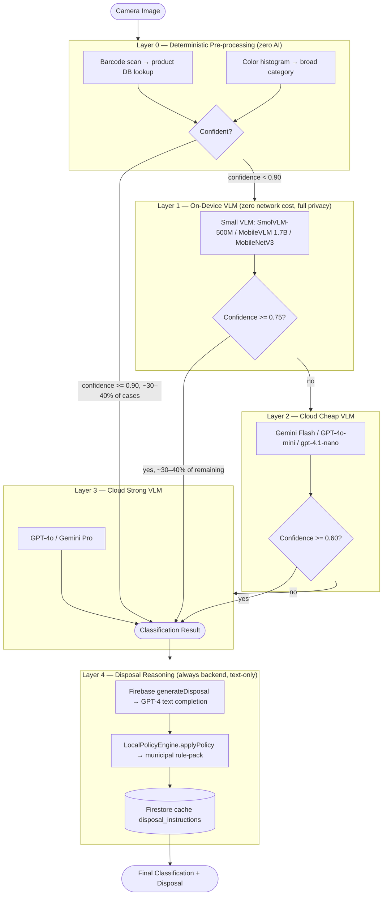

# Local-First VLM AI Roadmap — Waste Segregation App

**Date**: 2026-05-21
**Author**: Session review (Pranay)
**Status**: Roadmap draft — architectural target confirmed
**Repo**: `/Users/pranay/Projects/LLM/image/waste_seg/waste_segregation_app`

---

## 1. Current State

### Classification pipeline (as-is)

Every classification is a live cloud API call. There is no on-device inference in production today.

**Primary path** (`lib/services/ai_service.dart`, line 807):
- `analyzeImage()` / `analyzeWebImage()` — calls `_analyzeWithOpenAI()`
- Model: `ApiConfig.primaryModel` = `gpt-4.1-nano` (env: `OPENAI_API_MODEL_PRIMARY`)
- Fallback model: `gpt-4o-mini` / `gpt-4.1-mini` (secondary1, secondary2)
- Tertiary fallback: `_analyzeWithGemini()` — `gemini-2.0-flash` (triggered on `_shouldFallbackToGemini()` check at line 839)

**Fallback trigger** (`ai_service.dart:305–310`): only on `invalidImageTooLarge` or `providerUnavailable` error kinds, or after max retries. Confidence-based routing does not exist today.

**Production safety guard** (`ai_service.dart:1201`, `utils/production_safety_config.dart`):
- `ProductionSafetyConfig.guardClientAiCall('OpenAI')` blocks API calls in release builds unless explicitly opted in.
- This guard applies to ALL cloud paths. There is no on-device path that bypasses it.

**Disposal instructions** (`functions/src/index.ts`, line 207 — `generateDisposal`):
- Separate Firebase HTTP function, always cloud
- Model: `gpt-4` (text-only, function-calling)
- Caches results in Firestore `disposal_instructions/{materialId}`
- Text-only — no image transmitted to this endpoint

**On-device service status** (`lib/services/on_device_vision_service.dart`):
- Architecture and model type enum (`lib/models/vision_model_config.dart`) exist
- `_performInference()` is a placeholder (line 219) — returns synthetic result with `confidence: 0.0`
- `modelVersion: '1.0.0-placeholder'` (line 264)
- No real TFLite inference wired; `flutter_tflite` not in `pubspec.yaml` active dependencies

**Confidence field**: `WasteClassification.confidence` (`lib/models/waste_classification.dart:377`) is a `double?` returned by the cloud model in its JSON response. It is not calibrated. No confidence-based routing exists.

**VisionModelConfig** (`lib/models/vision_model_config.dart:62`): `confidenceThreshold = 0.7` (default). This field exists but no routing logic reads it to escalate to the next layer.

**Barcode scanning**: `mobile_scanner` is in `pubspec.yaml` but commented out (line 58: `# mobile_scanner: ^4.0.1  # Temporarily disabled due to dependency conflicts`). No barcode pre-processing path exists today.

**Summary table**:

| Component | Status |
|---|---|
| Cloud classification (OpenAI primary → Gemini fallback) | LIVE |
| Confidence-based cascade routing | NOT IMPLEMENTED |
| On-device inference (Layer 1) | PLACEHOLDER ONLY |
| Deterministic pre-processing (Layer 0) | NOT IMPLEMENTED |
| Backend classification proxy (Firebase classifyImage) | NOT IMPLEMENTED |
| Disposal reasoning (Firebase generateDisposal) | LIVE |
| Local policy engine post-processing | LIVE (`local_policy_engine.dart`) |
| AI cost tracking | LIVE (`ai_cost_tracker.dart`, `cost_guardrail_service.dart`) |

---

## 2. Target Architecture — 4-Layer Local-First Cascade



**Key properties of the target**:
- Layer 0 + Layer 1 are fully offline — no image leaves the device.
- Layer 2 transmits the image to Google/OpenAI.
- Layer 3 transmits the image to the strongest available cloud model.
- Layer 4 transmits only the text classification result (no image) to the Firebase backend.
- The `LocalPolicyEngine` (already live) applies municipal policy as a post-processing step on any layer's output before showing disposal advice.

---

## 3. Layer 0: Deterministic Pre-processing

### What it does

Handles items that don't need AI at all — completely deterministic, zero inference cost, instant result.

**Case A — Barcode scan**:
- Reads a barcode or QR code from the image
- Looks up the product in a database (Open Food Facts, custom product DB, or EU DPP resolver — see A23 in EXPLORATION_TOPICS.md)
- Returns category + disposal advice without any model call

**Case B — Color histogram**:
- Computes a simple HSV histogram on the input image
- Classifies into broad buckets: clearly organic (brown/green dominant), clearly plastic (bright/uniform color), clearly metal (reflective), etc.
- Confidence is high for single-color-dominant images (banana, bottle, can), low for complex multi-material scenes

**Expected coverage**: ~30–40% of real-world single-item household waste items. Fast-food packaging, beverage bottles, food scraps, newspaper — these are visually unambiguous when isolated.

### Flutter library options

| Use | Package | Notes |
|---|---|---|
| Barcode scan | `mobile_scanner` (currently disabled in pubspec.yaml) | Actively maintained; handles QR, EAN-13, UPC-A. Re-enable when dependency conflict resolved. |
| Barcode scan alternative | `flutter_barcode_scanner` | Less maintained; no preferred over `mobile_scanner` |
| Product DB lookup | Open Food Facts API (`world.openfoodfacts.org/api/v2`) | Free, global, 3M+ products. No key required for read. |
| EU Digital Product Passports | Per ESPR spec (product-specific resolver, not yet a stable API) | Track via `EXPLORATION_TOPICS.md` entry A23 |
| Color histogram | Custom Flutter implementation using `dart:typed_data` + `image` package (already a dependency via `ai_service.dart` imports) | The `image` package is already in the project |

### Implementation path

New file: `lib/services/deterministic_classifier.dart`

```dart
/// Layer 0: deterministic pre-processing
/// Returns null when confidence is below threshold (escalate to Layer 1)
class DeterministicClassifier {
  Future<WasteClassification?> classify(
    Uint8List imageBytes, {
    required double confidenceThreshold, // suggested: 0.90
  }) async {
    // Step 1: Try barcode scan on image
    final barcodeResult = await _tryBarcodeLookup(imageBytes);
    if (barcodeResult != null && barcodeResult.confidence >= confidenceThreshold) {
      return barcodeResult;
    }

    // Step 2: Try color histogram
    final histogramResult = await _tryColorHistogram(imageBytes);
    if (histogramResult != null && histogramResult.confidence >= confidenceThreshold) {
      return histogramResult;
    }

    return null; // escalate to Layer 1
  }
}
```

The deterministic classifier should be wired into the `AiService` routing layer before the first `_analyzeWithOpenAI` call, not as a parallel service. The routing controller (Phase 4 migration task) reads its output first.

---

## 4. Layer 1: On-Device Small VLM

### Model candidates

| Model | Size | Quality | Runtime | Privacy | Notes |
|---|---|---|---|---|---|
| **SmolVLM-500M** | ~1GB | Good for single-item clear scenes | TFLite / llama.cpp | Full | Explicitly supported in `VisionModelType.smolVLM`. Filename `smolvlm_waste_classifier.tflite` already referenced in `on_device_vision_service.dart:122`. |
| **MobileVLM 1.7B** | ~1.2GB | Good for common categories | llama.cpp via FFI, ONNX | Full | Better than MobileNet for open-ended VLM prompting |
| **moondream2 (1.8B)** | ~1.8GB | Good contextual understanding | llama.cpp via FFI | Full | Strong at answering "what is this?" |
| **MobileNetV3 + waste head** | ~20MB | Fast, classification-only | TFLite (native) | Full | Supported in `VisionModelType.mobileNetV3`. Very low latency, limited to known categories only. Not a VLM. |
| **EfficientNet-Lite** | ~5–25MB | Better than MobileNet | TFLite | Full | Supported in `VisionModelType.efficientNet`. No free-form output. |

**Recommended starting point**: MobileNetV3 + waste head for the first implementation (fast, small, well-understood), graduating to SmolVLM-500M when VLM capability matters.

### Runtime options

| Runtime | Package | Pros | Cons |
|---|---|---|---|
| **TFLite** | `tflite_flutter` | Well-maintained, native speed, NPU acceleration on Android/iOS | Only works with TFLite-format models; SmolVLM/moondream require conversion |
| **ONNX Runtime Mobile** | `onnxruntime` (pub.dev, Microsoft) | Wide model compatibility; runs ONNX exports from PyTorch/HF | Larger binary footprint |
| **llama.cpp via Dart FFI** | `llama_cpp_dart` or custom FFI | Runs GGUF models (MobileVLM, moondream2, SmolVLM) | Complex build, platform divergence, thermal risk |
| **MediaPipe** | `google_mediapipe` | Ready-to-go for classification tasks on device | Not VLM; classification-head only for pre-defined tasks |
| **Apple Core ML** | Via platform channel | iOS Metal/ANE acceleration | iOS-only; needs separate Android path |

**Current codebase state**: `tflite_preprocessing_helper.dart` exists but `tflite_flutter` is not in `pubspec.yaml`. The `on_device_vision_service.dart` has placeholder inference (line 160: `// TODO: Implement actual TFLite inference here`).

### Device requirements

| Metric | MobileNetV3 (TFLite) | SmolVLM-500M | MobileVLM 1.7B |
|---|---|---|---|
| Model storage | ~20MB | ~1GB | ~1.2GB |
| RAM at inference | ~50MB | ~800MB | ~1.2GB |
| Inference time (mid-tier Android) | <100ms | ~500–1500ms | ~1–3s |
| Thermal risk (sustained) | Low | Medium | High |
| NPU acceleration available | Yes (most devices) | Partial (depends on quantization) | Experimental |

**Minimum device target for SmolVLM**: 4GB RAM device (i.e., exclude sub-2019 budget Android). Gate behind `model_selection_service.dart` device-tier check.

### Privacy benefit

**Layer 0 and Layer 1 are the privacy moat.** For these two layers:
- Zero bytes of image data leave the device
- No third-party terms of service apply to the image content
- Works in airplane mode, school environments, corporate networks with HTTPS inspection
- No GDPR/DPDP exposure for the image content at all

This is a strong user-facing selling point. Surface it explicitly in the settings/premium UX: "Your photos stay on your device."

### Migration from current AiService

The current `AiService.analyzeImage()` is the single entry point for classification. The cascade routing belongs in a new controller that wraps `AiService`, not inside it.

The routing controller:
1. Calls `DeterministicClassifier.classify()` (Layer 0)
2. If null or confidence < threshold, calls `OnDeviceVisionService.analyzeImage()` (Layer 1)
3. If null or confidence < threshold, calls `AiService._analyzeWithOpenAI()` (Layer 2 — current cheap path)
4. If confidence < threshold, calls `AiService._analyzeWithOpenAI()` with strong model override (Layer 3)
5. Always calls backend `generateDisposal` with the result (Layer 4)

---

## 5. Layer 2: Cloud Cheap VLM

**Current implementation**: `AiService._analyzeWithOpenAI()` using `ApiConfig.primaryModel = gpt-4.1-nano`. This is already the cheap cloud path.

**Models**:
- `gpt-4.1-nano` (current primary) — very cheap, fast, decent for clear waste
- `gpt-4o-mini` (current secondary1) — slightly better, still cheap
- `gemini-2.0-flash` (current tertiary) — Google's cheap path, already wired

**When to use**: Layer 1 returns confidence < 0.75, or Layer 1 is unavailable (model not downloaded, device too old, first-launch before download).

**Cost model per classification** (estimated, 2026 pricing):
- gpt-4.1-nano: ~$0.0003–0.0008 per call (1500 input + 800 output tokens @ current rates)
- gpt-4o-mini: ~$0.0005–0.0012 per call
- gemini-2.0-flash: ~$0.0003 per call (Gemini Flash pricing tier)

The `DynamicPricingService` and `CostGuardrailService` already track these. The cascade routing should record which layer handled each classification for cost telemetry.

---

## 6. Layer 3: Cloud Strong VLM

**Current implementation**: No explicit "strong model" routing exists. The current fallback goes OpenAI primary → OpenAI secondary → Gemini (for errors/size issues, not confidence).

**Models**:
- `gpt-4o` — strongest OpenAI vision model, ~10-20x cost of gpt-4.1-nano
- `gemini-1.5-pro` or `gemini-2.0-pro` — Google's strong model
- Reserved for: multi-material complex scenes, unusual items, low-confidence outputs from Layer 2

**When to use**: Layer 2 confidence < 0.60, or `clarificationNeeded: true` in the Layer 2 response, or item category is `Hazardous` / `Medical` (high-stakes — always escalate).

**Cost model**: ~$0.003–0.015 per call. Should be a small fraction of total classifications.

**Implementation note**: `ApiConfig.secondaryModel1 = gpt-4o-mini` and `secondaryModel2 = gpt-4.1-mini` (constants.dart:23–28). The "strong" model is not yet a named constant — add `ApiConfig.strongModel = 'gpt-4o'` when implementing Layer 3 routing.

---

## 7. Confidence Threshold Policy

### Proposed thresholds

| Threshold | Value | Rationale |
|---|---|---|
| Layer 0 → pass | >= 0.90 | Deterministic — high confidence means barcode match or very clean histogram |
| Layer 1 → pass | >= 0.75 | On-device VLM; single-item scenes should hit this for common categories |
| Layer 2 → pass | >= 0.60 | Cloud cheap; accept results above this; anything below likely edge case |
| Layer 2 → Layer 3 trigger | < 0.60 OR `clarificationNeeded: true` | Force strong model for genuinely ambiguous items |
| Hazardous/Medical → always Layer 3 | override | Safety-critical — never accept low confidence |

These thresholds are **starting hypotheses**, not calibrated values. They must be tuned using the Eval Harness (see Section 11).

### Current confidence field

`WasteClassification.confidence` is a `double?` (`waste_classification.dart:377`) populated from the model's JSON response. The model self-reports confidence in its structured output — this is the model's estimate, not a calibrated probability. Treat as an uncalibrated signal until the Eval Harness exists.

`VisionModelConfig.confidenceThreshold = 0.7` (`vision_model_config.dart:62`) is a default that should map to the Layer 1 threshold once real inference is wired.

### Fallthrough criteria

An item escalates to the next layer when ANY of:
- Confidence is below the layer's pass threshold
- `clarificationNeeded: true` in the response
- Classification category is hazardous or medical (hard override, always escalate)
- Layer returned an error / null (infrastructure failure — not a confidence issue; escalate immediately, don't count as failed classification)

An item is returned at the current layer when:
- Confidence >= pass threshold AND
- `clarificationNeeded: false` AND
- Category is not in the always-escalate list

### Layer selection telemetry

Every final classification MUST record which layer handled it:
```
modelSource: 'layer0_barcode' | 'layer0_histogram' | 'layer1_on_device' | 'layer2_cloud_cheap' | 'layer3_cloud_strong'
```

This feeds the cost model, the eval harness, and the threshold tuning loop.

---

## 8. Offline Mode

### What works offline with the 4-layer cascade

| Layer | Works offline? | Notes |
|---|---|---|
| Layer 0 (deterministic) | Yes | Barcode → local product DB (needs pre-loaded). Color histogram → fully local. |
| Layer 1 (on-device VLM) | Yes | Once model is downloaded, inference is fully local |
| Layer 2 (cloud cheap) | No | Requires network |
| Layer 3 (cloud strong) | No | Requires network |
| Layer 4 (disposal reasoning) | Partial | Firestore cache for previously seen materials. New materials need network. |

**Practical offline experience** after Layer 0 + Layer 1 are live:
- The majority of common household items should be classifiable offline once the model is downloaded.
- Items that escalate past Layer 1 get queued via the existing `offline_queue_*` service for later processing.

**UX when offline with no on-device model available** (initial period before model download):
- Show a message: "Classification requires an internet connection. A local model is available to download for offline use."
- Allow the user to capture the photo and queue it.
- Do NOT show a failure state — frame it as "queued for analysis."
- See also: `Offline-First Flow` (entry 9, EXPLORATION_TOPICS.md).

**Offline degradation tiers**:
1. Layer 0 + Layer 1 available: full offline classification
2. Only Layer 0 available (model not downloaded): deterministic-only, clear items handled, complex items queued
3. Neither available (first launch, no Wi-Fi for download): capture + queue; show cached results from history

---

## 9. Privacy and Data Retention by Layer

| Layer | Image transmitted off-device? | To whom? | Data retained? |
|---|---|---|---|
| Layer 0 — Barcode | No | — | No |
| Layer 0 — Histogram | No | — | No |
| Layer 1 — On-device | No | — | No |
| Layer 2 — Cloud cheap | **Yes** | OpenAI or Google (depending on model) | Per provider ToS. OpenAI: used for safety monitoring, not training by default. Google: per Cloud API ToS. |
| Layer 3 — Cloud strong | **Yes** | OpenAI or Google | Same as Layer 2 |
| Layer 4 — Disposal reasoning | Text only (material name, category) | Firebase backend → OpenAI gpt-4 | Text cached in Firestore `disposal_instructions` |

**Privacy posture summary**:
- Layer 0 + Layer 1: Zero PII exposure. Suitable for kids mode, school use, corporate BYOD.
- Layer 2 + Layer 3: Image goes to third-party providers. Consent required for users who have opted into stricter privacy.
- On-device image storage: `EnhancedImageService.saveFilePermanently()` saves all images permanently on-device before analysis (see `ai_service.dart:751`). This is the **primary PII risk** — images are stored locally indefinitely. Requires retention policy (see `Data Retention & PII Strategy`, entry 14).

**Privacy disclosure requirement**: before any image is transmitted to a cloud provider, the app must have disclosed this in the privacy policy and (for GDPR/DPDP jurisdictions) obtained explicit consent. The existing consent architecture (`user_consent_service.dart`) should be extended to include a per-classification consent signal if the user has opted for "local only."

---

## 10. Cost Savings Model

### Current state: every classification = 1 cloud call

Current approximate cost per classification:
- gpt-4.1-nano: ~$0.0003–0.0008 per classification
- At 100K classifications/month: ~$30–80/month
- At 1M classifications/month: ~$300–800/month

These are not large numbers today, but they scale linearly with users and do not improve without architectural change.

### Target state: most classifications handled locally

Conservative estimate assuming Layer 0 + Layer 1 reach production quality:

| Layer | % of total classifications handled | Cost per call |
|---|---|---|
| Layer 0 (deterministic) | ~30% | $0.000 |
| Layer 1 (on-device) | ~35% | $0.000 |
| Layer 2 (cloud cheap) | ~25% | ~$0.0005 |
| Layer 3 (cloud strong) | ~10% | ~$0.005 |

**Cost at 1M classifications/month**:
- Current: ~$500/month (all cloud cheap)
- Target: ~$0 (L0+L1, 65%) + ~$125 (L2, 25%) + ~$500 (L3, 10%) = **~$625/month**

Wait — this looks worse at 10% strong-model rate. The cost savings come from avoiding Layer 3 creep and from the token economy: with local layers absorbing easy cases, Layer 2 handles genuinely medium-hard cases and Layer 3 only sees truly hard cases. The real savings metric is **cost per correct classification**, not cost per call.

**Better framing**: without the cascade, users on free tier hit budget caps quickly. With Layer 0 + Layer 1, the per-user cloud cost drops ~65%, allowing more free-tier headroom or better unit economics on the paid tier.

---

## 11. Eval Harness Requirements

### What's needed before tuning any threshold

Without an eval harness, threshold tuning is guesswork. The harness is upstream of everything in this roadmap.

**Minimum viable golden set**:
- Size: 500 labeled images minimum; 2000 for reliable calibration
- Category distribution: proportional to real-world waste (household plastic, paper, organic, mixed) plus oversampled edge cases (multi-material, hazardous, unusual)
- Sources: app user corrections (highest value), existing public datasets (TrashNet, TACO), manually labeled photos
- Ground truth fields: `category`, `subcategory`, `materialType`, expected `confidence >= threshold` value, `clarificationNeeded` expectation

**Per-layer accuracy targets** (proposals — calibrate against actual):

| Layer | Precision@top1 target | Recall target | Escalation rate |
|---|---|---|---|
| Layer 0 (barcode) | >= 0.99 | N/A | ~10% of scanned items have barcodes |
| Layer 0 (histogram) | >= 0.90 | >= 0.70 on clear items | ~20–30% of items |
| Layer 1 (on-device VLM) | >= 0.82 | >= 0.75 | Target: handle 35% of cases |
| Layer 2 (cloud cheap) | >= 0.88 | >= 0.85 | Handle 25% |
| Layer 3 (cloud strong) | >= 0.95 | >= 0.92 | Handle 10% |

**Confidence calibration check**:
- Plot confidence histogram by layer and by correct/incorrect label
- A well-calibrated layer should show: confidence >= 0.75 predictions are correct >= 75% of the time
- Any layer where `confidence >= 0.75` is only correct 60% of the time is miscalibrated — lower its pass threshold or discard its confidence signal

**CI integration**:
- Run the golden set against each provider/model on every prompt change
- Regression gate: if Layer 2 accuracy drops > 2% from baseline, block the change
- Cost gate: if average cost per classification increases > 20%, require explicit approval

---

## 12. Migration Path

### Phase 0: Pre-conditions (mostly complete; keep these aligned as the cascade evolves)

Before building any new layer, close and preserve the gaps that affect everything downstream:

1. **Keep `BackendProxyProvider` as the canonical cloud route** — the Firebase `classifyImage` callable is already live and routes cloud classifications through a server-side gateway. This enables:
   - Server-side auth, App Check, and rate limiting on classification
   - Server-side cost tracking and cache telemetry
   - Future provider swaps without app release
   - A release-safe path that does not depend on client API keys

2. **Add classification source field** — extend `WasteClassification` model with a `classificationLayer` enum field (`layer0_barcode`, `layer0_histogram`, `layer1_on_device`, `layer2_cloud_cheap`, `layer3_cloud_strong`). This is cost-free to add now and enables telemetry for all future phases.

### Phase 1: Deterministic Classifier (Layer 0)

**Target**: Handle ~30% of classifications with zero AI cost.

Tasks:
- Re-enable `mobile_scanner` in `pubspec.yaml` (dependency conflict needs investigation)
- Implement `lib/services/deterministic_classifier.dart` with barcode lookup + color histogram
- Integrate Open Food Facts API call for barcode lookup (or local product DB for offline)
- Wire into routing controller (new `ClassificationRouter` service)
- Add `layer: 'layer0_barcode'` or `layer: 'layer0_histogram'` to result metadata
- Add to eval harness: measure Layer 0 handle rate and accuracy

**Estimated effort**: 2–3 weeks.

### Phase 2: Backend Proxy (completed)

**Target**: Route cloud classifications through Firebase instead of direct from client.

Tasks:
- `classifyImage` callable is already implemented in `functions/src/classify_image.ts`
- `classifyImage` is exported from `functions/src/index.ts`
- `AiService` now routes release classification through `BackendProxyProvider`
- Release remains fail-closed to the backend path
- Keep the direct client path only for controlled debug/profile and fallback flows

**Estimated effort**: 1–2 weeks.

### Phase 3: On-Device VLM (Layer 1)

**Target**: Handle an additional ~35% of classifications with zero cloud cost.

Tasks:
- Implement real TFLite inference in `OnDeviceVisionService._performInference()` (currently placeholder, line 160)
- Start with MobileNetV3 + waste-classification head (smallest, fastest, safest)
- Add `tflite_flutter` to `pubspec.yaml`
- Model packaging: download via `model_download_service.dart` (already exists) on first use
- Model size gate: only enable on devices with >= 3GB available storage
- Add to routing controller: run on-device before cloud
- Benchmark on mid-tier Android (Snapdragon 680 class) and iOS (A14+)

**Estimated effort**: 4–6 weeks (model integration is non-trivial).

### Phase 4: Confidence-Based Routing (Full Cascade)

**Target**: Wire all four layers into the routing controller with threshold-based escalation.

Tasks:
- Create `lib/services/classification_router.dart`
- Implement routing logic: L0 → L1 → L2 → L3 based on confidence thresholds
- Always-escalate list for hazardous/medical categories
- Log `classificationLayer` on every result
- Run eval harness to calibrate thresholds
- A/B test: compare baseline (all cloud) vs cascade (all layers) on key metrics (accuracy, cost, latency)

**Estimated effort**: 2–3 weeks (plus eval harness work).

---

## 13. Implementation Timeline

### Pre-launch must-haves (before public release)

| Item | Why pre-launch |
|---|---|
| `ProductionSafetyConfig` guard — ensure no direct API keys in release build | Security P0 |
| Backend proxy `classifyImage` (Phase 2) | Done; cost protection and App Check enforcement now exist |
| `classificationLayer` telemetry field | Required to measure all other phases |
| Offline degradation UX | Users in low-connectivity areas see coherent experience |

### Post-launch exploration (can ship after initial release)

| Item | Why post-launch |
|---|---|
| Layer 0 deterministic classifier | Nice-to-have for cost reduction; not required for correctness |
| Layer 1 on-device VLM | High effort; privacy moat; privacy-first users are a niche at launch |
| Full confidence-based cascade (Phase 4) | Requires eval harness first; eval harness requires real user data |
| Eval harness (golden set) | Needs real user correction data; grows post-launch |
| Threshold calibration | Needs eval harness + real data |

### Rough timeline (optimistic, single engineer)

```
Month 1:  Phase 0 (proxy scaffold) + classificationLayer field
Month 2:  Layer 0 deterministic classifier (Phase 1)
Month 3:  Backend proxy live and release routing hardened
Month 4-5: On-device MobileNetV3 integration (Phase 3, part 1)
Month 6:  SmolVLM-500M integration + eval harness baseline (Phase 3, part 2)
Month 7+: Threshold calibration + full cascade routing (Phase 4)
```

---

## 14. Open Questions

1. **Layer 0 product DB**: Use Open Food Facts (free, global, ~3M products) or build a custom local product DB? Custom DB avoids network dependency but requires curation. Likely hybrid: local DB for top-N common items + OFO API fallback.

2. **Model distribution**: Bundle Layer 1 model in the app binary (~20MB for MobileNetV3) or lazy-download (~1GB for SmolVLM)? Bundled increases APK size; lazy-download requires user action and network. The right answer depends on the target audience's connectivity profile.

3. **Layer 2/3 provider decision**: Is Gemini Flash (Google) preferred over gpt-4.1-nano (OpenAI) for Layer 2? Currently both are wired. The eval harness should determine which has better accuracy/cost ratio for waste classification specifically.

4. **Confidence calibration methodology**: The model's self-reported confidence is not well-calibrated. Consider temperature scaling or Platt scaling on top of model outputs. This requires the eval harness first.

5. **iOS vs Android parity**: TFLite on iOS uses Core ML delegation (good); Android uses NNAPI or GPU delegation (varies). The Layer 1 model selection policy in `model_selection_service.dart` must account for this divergence.

6. **Backend proxy image size**: Transmitting base64 image bytes through Firebase Functions has a 32MB request body limit. For large images, the proxy may need to accept a Cloud Storage URL instead of raw bytes. This changes the image handling architecture significantly.

---

## 15. Related Documents

- `docs/EXPLORATION_TOPICS.md` — entries 1, 5, 6, 7, 9, 10, 14; new entries appended 2026-05-21
- `docs/review/LOCAL_MODEL_READINESS_SPLIT_2026-05-21.md` — current on-device readiness audit
- `docs/review/BACKEND_PLATFORM_AND_MONEY_STRATEGY_2026-05-20.md`
- `lib/services/ai_service.dart` — current classification implementation
- `lib/services/on_device_vision_service.dart` — placeholder on-device service
- `lib/models/vision_model_config.dart` — model config + confidence threshold
- `lib/services/local_policy_engine.dart` — Layer 4 policy post-processing (already live)
- `functions/src/index.ts` — backend disposal reasoning (Layer 4, live)
- `lib/utils/production_safety_config.dart` — release build AI guard
- `lib/utils/constants.dart` — model names, API config

---

*Last updated: 2026-05-21. Owner: Pranay. Status: Roadmap draft — architectural direction confirmed, implementation not started.*
